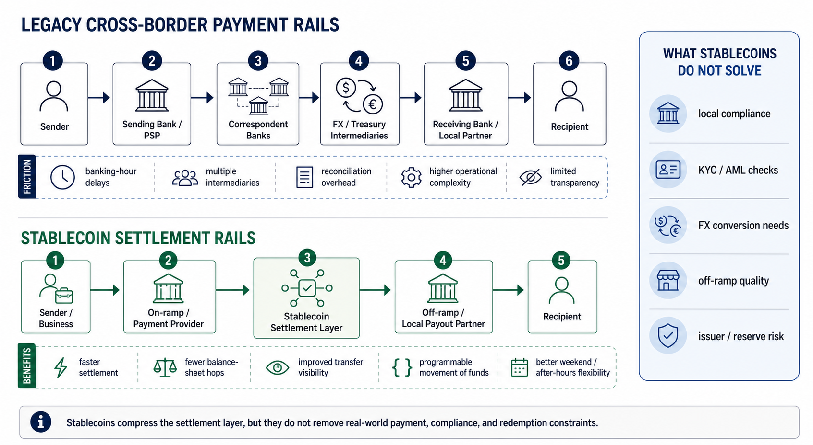

# What Stablecoin Settlement Rails Actually Change for Cross-Border Payments

Stablecoin settlement rails improve the **settlement layer** of cross-border payments. They make value transfer more continuous, visible, and programmable, but they do not remove compliance, FX conversion, or fiat payout dependencies.

Stablecoin payment headlines often overstate the story. They suggest that cross-border payments become instant, bank-free, and frictionless the moment money moves onto a blockchain.

That is not what is happening.

What stablecoin settlement rails actually change is narrower, but still important: they compress the settlement layer. They let firms move a digital dollar or euro-like asset on a 24/7 ledger, with fewer intermediaries, faster finality, and easier automation than many traditional correspondent banking flows.

They do **not** eliminate compliance, foreign exchange, local payout infrastructure, or the need to trust the issuer behind the stablecoin.

As of **June 2026**, this is best understood as an infrastructure buildout story, not a full replacement story for cross-border banking.

That distinction matters if you are trying to understand where stablecoins genuinely improve cross-border payments, and where the hard parts still live.

*Editorial explainer: stablecoins compress the settlement layer, but they do not remove compliance, FX, off-ramp, or issuer-risk constraints.*

## Quick Answer

If you only need the short version, this is it:

Stablecoin settlement rails change five things in cross-border payments:

1. They replace banking cut-off windows with 24/7 blockchain-based settlement.
2. They reduce the number of balance sheet hops between sender and receiver.
3. They make movement and reconciliation more visible on a shared ledger.
4. They let businesses hold and route settlement liquidity in tokenized cash equivalents such as USDC.
5. They make payment logic programmable, which matters for treasury, payouts, and platform workflows.

They do **not** automatically solve:

1. KYC, AML, sanctions screening, and local compliance.
2. Fiat off-ramping into the recipient's bank account.
3. FX conversion when the sender and receiver need different currencies.
4. Issuer risk, reserve quality, or redemption risk.
5. Wallet, custody, smart contract, or chain-level operational risk.

## Best Fit / Not Ideal For

**Best fit for:**

1. recurring B2B payments, payroll, treasury rebalancing, and marketplace payouts
2. corridors where banking cut-off windows, prefunding, and reconciliation create real friction
3. dollar-denominated flows where recipients can hold or easily redeem a stablecoin balance
4. businesses that already have compliance, custody, and payout partners in place

**Not ideal for:**

1. low-frequency, low-value transfers where integration effort outweighs the gain
2. corridors where the recipient only wants immediate local-currency payout
3. flows with weak off-ramp support, weak redemption access, or unclear issuer quality
4. teams that are not prepared to manage custody, chain, and compliance operations

## Stablecoin Rails vs Legacy Cross-Border Rails at a Glance

| Question | Legacy cross-border flow | Stablecoin settlement rail | What still has to be solved |
| --- | --- | --- | --- |
| When does settlement happen? | Often tied to banking hours, cut-off windows, and batch processing | Can move 24/7 on supported blockchain networks | Off-ramp timing and local payout timing |
| How many ledger hops are involved? | Usually multiple institutions update separate ledgers | Fewer balance-sheet hops for the settlement leg | Compliance and local banking counterparties still matter |
| Where does liquidity sit? | Often fragmented across correspondent accounts and prefunded balances | Can be held in mobile tokenized cash balances such as USDC | Redemption access and treasury controls |
| How visible is payment status? | Often opaque across institutions | Transfer state is visible on a shared ledger | Internal accounting and exception handling |
| Can the flow be automated? | Often limited by file-based or bank-window workflows | Easier to embed in treasury, payout, and software workflows | Governance, risk, and operational design |

## Key Takeaways

1. Stablecoins do not replace all cross-border payment infrastructure. They mostly improve the settlement layer inside it.
2. The real gain is not only speed. It is lower coordination cost across liquidity, reconciliation, and timing.
3. Stablecoin rails work best for recurring, cross-jurisdictional, operationally messy payment flows.
4. The first and last mile still depend on compliance, FX, and local payout depth.
5. The right question is not "is this on-chain?" but "is the full settlement rail usable end to end?"

## Why Stablecoin Rails Matter Beyond Speed

The clearest way to understand stablecoin rails is this: they do not just move money faster. They reduce **coordination cost** across the payment stack.

In legacy cross-border payments, messaging, settlement, reconciliation, liquidity placement, and payout are often handled by different institutions on different ledgers. That fragmentation is why even "digital" international payments can still feel slow, opaque, and operationally heavy.

Stablecoin rails compress more of that process into one software-addressable object:

1. the settlement asset is digital and programmable
2. transfer status is visible on a shared ledger
3. liquidity can be held in one interoperable balance instead of multiple fragmented accounts
4. payment instructions can be linked directly to treasury and payout logic

That is the deeper value. Stablecoins do not only change **speed**. They change the cost of coordinating money movement across systems, entities, and time zones.

This framing also explains why the strongest stablecoin use cases tend to be recurring, operationally messy, and cross-jurisdictional. The more reconciliation, prefunding, and timing friction a payment flow has, the more a stablecoin settlement rail can matter.

## Why Cross-Border Payments Still Feel Broken

The baseline problem is not that moving money across borders is impossible. It is that the process is still fragmented.

The [Bank for International Settlements](https://www.bis.org/topics/cross_border_payments.htm) has repeatedly framed cross-border payments as too slow, too expensive, too opaque, and too inaccessible. The [World Bank's Remittance Prices Worldwide database](https://remittanceprices.worldbank.org/) continues to show that sending money internationally still carries meaningful cost. In its March 2025 report, the World Bank said the global average cost of sending **$200** was **6.49%** in **Q1 2025**, while the digital remittance average was **4.85%**, still above the UN's **3%** target.

The same report shows why infrastructure matters more than slogans:

1. banks remained the costliest remittance provider type at **14.55%** on average in Q1 2025
2. the United States averaged **5.56%** as a sending market in Q1 2025
3. digital services accounted for only **29%** of tracked services

That is the real opening for stablecoin rails. They are most compelling where payment friction is still driven by provider layers, funding structure, and reconciliation overhead rather than by the user interface alone.

In the traditional model, a cross-border payment often touches several layers at once:

1. the originating bank or payment provider
2. one or more correspondent banks
3. foreign exchange intermediaries
4. compliance and sanctions controls
5. the receiving bank or local payout partner

That structure creates delays, cut-off times, trapped liquidity, and reconciliation overhead. A payment can be initiated digitally, but the underlying process may still depend on batch windows, messaging rails, prefunded accounts, and institutions updating separate ledgers.

This is the part stablecoins are attacking most directly.

## What Is a Stablecoin Settlement Rail?

A stablecoin settlement rail is not just the token itself. It is the full path that lets value move from one party to another using a stablecoin as the settlement asset.

In practice, that stack usually includes:

1. the stablecoin issuer and reserve model
2. the blockchain or network the asset runs on
3. wallets, custodians, or payment service providers
4. on-ramp and off-ramp partners
5. compliance, monitoring, and transaction orchestration layers

That is why this topic belongs as much to `Infrastructure` as to `Protocols`.

When a business settles in USDC, for example, it is not only choosing a token. It is choosing an issuer, a redemption model, a chain, an operational workflow, and a set of counterparties that can accept and redeem that asset reliably.

## How Stablecoin Rails Change Cross-Border Payments

### 1. They turn settlement into a 24/7 process

Traditional cross-border payments are still constrained by banking hours, local holidays, and cut-off windows. Stablecoin rails move on public blockchain networks that operate continuously.

[Circle](https://www.circle.com/usdc) markets USDC as internet-native money that moves globally and around the clock. [Stripe's stablecoin guide](https://stripe.com/resources/more/stablecoin-cross-border-payments) makes a similar point: stablecoins can reduce delays for global payroll, vendor payments, and remittances because they are not bound to the same operating schedule as legacy banking rails.

This does not mean every recipient gets usable fiat instantly. It means the **settlement asset** can move instantly or near instantly between supported endpoints, even when banks are closed.

That is a major operational change for treasury teams, global marketplaces, and payment coordinators.

### 2. They reduce intermediary hops

In a correspondent banking chain, every additional institution can add cost, delay, and uncertainty. Stablecoin transfers can let two parties settle against the same blockchain ledger instead of waiting for multiple private ledgers to update.

[Visa's stablecoin settlement work](https://usa.visa.com/solutions/crypto/stablecoin.html) is built around this exact idea: using blockchain networks and stablecoins such as USDC to extend settlement windows and simplify value movement between participants. On [December 16, 2025](https://usa.visa.com/about-visa/newsroom/press-releases.releaseId.21641.html), Visa said its stablecoin-linked settlement activity had reached a monthly run rate equivalent to more than $3.5 billion annualized.

That does not mean banks disappear. It means fewer balance sheet hops may be needed for the settlement leg itself.

### 3. They change where liquidity sits

One of the least understood benefits of stablecoin rails is liquidity design.

In traditional cross-border systems, providers often need capital parked across multiple jurisdictions or correspondent accounts. Stablecoin rails can let firms concentrate part of that liquidity in a stablecoin, then deploy it across markets when needed.

This is not a magic removal of funding needs. It is a shift from fragmented prefunding toward more mobile, programmable liquidity.

That is one reason stablecoins are gaining attention in business payments, not just retail crypto. In a [speech published by the European Central Bank on May 29, 2026](https://www.ecb.europa.eu/press/key/date/2026/html/ecb.sp260529_1~7ac66119bb.en.html), Executive Board member Piero Cipollone argued that stablecoins are increasingly functioning as a bridge between crypto and traditional finance, especially in cross-border activity.

### 4. They improve ledger visibility and reconciliation

Traditional cross-border payments often separate the message from the money movement. A transaction may have reference data in one system and settlement state in another.

Stablecoin rails put transfer state on a shared ledger. That gives payment operations, compliance teams, and treasury managers a different kind of visibility. Participants can track transaction status on-chain, verify receipt more quickly, and automate downstream reconciliation.

That does not remove internal accounting work. It does reduce some of the ambiguity around where a payment is in the process.

For high-volume businesses such as payroll platforms, exchanges, B2B payout providers, and marketplaces, this matters as much as raw speed.

### 5. They make cross-border payment logic programmable

Stablecoin rails are not only about moving value faster. They are also about embedding payment rules into software.

A firm can trigger vendor payments after a condition is met, release marketplace payouts on a schedule, sweep treasury balances between entities, or sync on-chain receipt with internal systems. That is harder when the payment stack is built around batch files, banking cut-offs, and disconnected ledgers.

This is where the "rail" matters more than the token ticker. A useful stablecoin payment stack is one that supports custody, controls, reporting, routing, and redemption with enough reliability for real business workflows.

## What Stablecoin Settlement Looks Like in Real Operations

The easiest way to make this concrete is to look at how stablecoin settlement works in live payment stacks rather than in abstract crypto diagrams.

### Example 1: Deel and Stripe

On **June 3, 2026**, Stripe announced that Deel was using Stripe infrastructure to help contractors in **150+ countries** hold, earn, and spend a dollar-backed balance. Stripe said Deel supports **40,000+ businesses** and **1.5 million workers** worldwide.

More importantly, Stripe described the actual operational flow:

1. an employer pays Deel
2. Stripe handles the collection flow and fraud screening
3. Bridge converts US dollars into Deel's stablecoin balance
4. the balance lands in an embedded wallet
5. the contractor receives a dollar-backed balance that settles nearly instantly on the underlying network

This is a good example because it shows what stablecoins change in practice. The user does not need to think about blockchain mechanics. What changes is the backend: faster settlement, programmable wallet balances, and less dependence on slow international payout timing.

Stripe also added one demand signal that matters: according to Deel, in **2025**, **85%** of contractors in Argentina wanted to be paid in US dollars rather than Argentine pesos.

### Example 2: Visa stablecoin settlement

Visa's use case is different. It is not retail remittance marketing. It is backend settlement modernization.

Visa said on **July 31, 2025** that its settlement platform was expanding support to more stablecoins, more chains, and EURC, on top of existing support for Ethereum and Solana. A separate Visa post on **December 17, 2025** said the company was using stablecoins to support **365-day settlement** and that its monthly volume had passed a **$2.5 billion annualized run rate**. In its **December 16, 2025** press release, Visa separately said stablecoin-linked settlement activity had reached a monthly run rate equivalent to more than **$3.5 billion annualized**.

The key point is not the exact run-rate number. The key point is that a major payments network is using stablecoins to digitize the **backend of money movement** rather than talking only about consumer crypto wallets.

### Example 3: Circle's OFI-to-BFI model

Circle's [Circle Payments Network](https://www.circle.com/cpn) is useful because it spells out the institutional operating model directly.

In Circle's design:

1. an Originating Financial Institution verifies the sender, performs checks, converts fiat to stablecoins, and sends the payment
2. a Beneficiary Financial Institution receives the stablecoins, converts them into local fiat, and pays the recipient

Circle positions this as a way to reduce prefunding, improve capital efficiency, and unlock global fiat payouts through one integration rather than through many bilateral relationships.

That flow shows the real architecture clearly. Stablecoins improve the **intermediate settlement layer**, but the regulated institutions, compliance checks, and fiat payout endpoints still matter at both ends.

## What Stablecoin Rails Do Not Fix

This is the section many crypto explainers skip.

### Compliance still matters

Stablecoins do not bypass AML, sanctions, travel rule, licensing, or local regulatory obligations. If anything, serious payment providers using stablecoins become more compliance-heavy, not less.

This is one reason why large firms entering the space are building around regulated entities, monitored wallets, and formal payout partnerships rather than pure peer-to-peer flows.

### Off-ramping is still the hard edge

A supplier or freelancer may be happy to receive USDC. Many recipients are not. They still need local currency in a bank account, mobile wallet, or cash network.

That means the real user experience depends on local payout coverage, banking integrations, and conversion costs. Stablecoin settlement can improve the middle of the flow while the first and last mile remain country-specific.

### FX does not disappear

A dollar stablecoin is useful because the dollar is globally accepted. But if a recipient ultimately needs pesos, naira, reais, or euros, someone still has to do the conversion.

Stablecoin rails can make the settlement leg cleaner, but they do not erase currency mismatch.

### Issuer and redemption quality matter a lot

Not every stablecoin is equally suitable for cross-border settlement.

The payment use case depends on whether the asset is widely accepted, redeemable, transparent, and operationally supported. A stablecoin with weak reserve disclosures, poor redemption access, or limited institutional integrations is a weaker payment rail even if it trades near peg most of the time.

This is why the next article in the cluster, on reserve transparency, is not a side topic. It is core payment infrastructure analysis.

### Chain and wallet risk still exist

Public blockchains introduce their own tradeoffs: congestion, chain-specific reliability, bridge dependencies, smart contract exposure, and custody design choices.

A payment rail is only as usable as its operational stack.

## Where Stablecoin Rails Work Best Today

The strongest use cases are not "all payments." They are payment types where settlement speed, operating hours, treasury flexibility, and digital-native endpoints matter most.

### B2B supplier settlement

Cross-border business payments often suffer from bank delays, high fees, and reconciliation complexity. Stablecoins can improve the settlement leg, especially when both parties are already comfortable holding dollar-denominated balances.

### Global payroll and contractor payouts

This is one of the clearest adoption paths. Stripe explicitly highlights payroll and vendor payments in its stablecoin payment material because global disbursements benefit from continuous settlement and easier digital distribution.

### Marketplace and platform payouts

Platforms that pay creators, sellers, affiliates, or contributors across multiple countries benefit when the payout asset moves on one shared ledger instead of fragmented local banking rails.

### Treasury rebalancing

Exchanges, payment firms, and global internet businesses increasingly use stablecoins for internal liquidity movement across regions, entities, and operating accounts.

### Some remittance corridors

Stablecoins can help in remittance flows, but only where wallet adoption, local cash-out options, and regulatory support are strong enough. They are not a universal shortcut.

## Stablecoins Are Not the Only Way to Modernize Cross-Border Payments

A useful authority article should also acknowledge that stablecoins are not the only way to improve cross-border payments.

The BIS has been working on projects such as [Project Nexus](https://www.bis.org/about/bisih/topics/fmis/nexus.htm), which links domestic instant payment systems, and [Project Agorá](https://www.bis.org/about/bisih/topics/fmis/agora.htm), which explores tokenized commercial bank money and central bank money for wholesale cross-border settlement.

That comparison matters because the BIS is making a similar diagnosis from a different institutional angle. In its [June 24, 2025 press release](https://www.bis.org/press/p250624.htm), the BIS said tokenization can integrate **messaging, reconciliation, and settlement** into a single operation. In other words, even central-bank-oriented modernization is converging on the same core idea: the real gain is not just moving money faster, but reducing the number of disconnected processes around the payment.

That matters for two reasons:

1. It shows that the market agrees the legacy model is inefficient.
2. It shows that stablecoins are competing with, and sometimes complementing, bank-led modernization rather than replacing all existing rails outright.

The real question is not whether stablecoins "win everything." The real question is where stablecoin rails deliver a better cost-speed-control tradeoff than correspondent banking, linked instant payments, or tokenized bank deposit systems.

## Why This Is Really an Infrastructure Story

The biggest mistake in stablecoin coverage is treating payment adoption as a token popularity contest.

For cross-border payments, the decisive factors are usually infrastructural:

1. Can the stablecoin be redeemed reliably?
2. Is reserve disclosure credible?
3. Which chains and wallets support the asset well?
4. Are on-ramp and off-ramp partners deep enough in the target markets?
5. Can businesses automate controls, reconciliation, and reporting around it?

That is why "stablecoin payments" is not just a `Stablecoins` topic. It is also a payment infrastructure topic, a treasury topic, and a risk topic.

## Bottom Line

Stablecoin settlement rails do not remove borders. They remove some of the friction inside the settlement layer that sits between borders.

That is still a big shift.

They make value movement more continuous, more programmable, and often more transparent. They can reduce dependence on banking cut-off windows and simplify how liquidity is staged for international payments.

But the hard parts of cross-border finance still matter: compliance, redemption, FX, local payout, and trust in the issuer and infrastructure stack.

In **2025-2026**, the strongest evidence still points to backend settlement, treasury, and payout modernization rather than universal retail payment replacement.

So if you want to evaluate stablecoins in payments seriously, do not ask only whether a token is popular.

Ask whether the full settlement rail is usable.

## A Simple Decision Framework

If you are evaluating whether a stablecoin rail is actually better than a traditional cross-border flow, use these seven questions.

### 1. What exactly is broken in the current flow?

Stablecoins are most useful when the pain is settlement latency, trapped liquidity, after-hours timing, reconciliation overhead, or corridor fragmentation. They are less useful when the real issue is poor local banking access or difficult compliance in the destination market.

### 2. Does the recipient need dollars or local currency?

If the recipient is comfortable holding a dollar-backed balance, stablecoins can solve more of the payment stack. If the recipient needs immediate local fiat, then off-ramp depth and FX costs become decisive.

### 3. Is the flow recurring enough to justify infrastructure work?

Stablecoin rails are usually strongest for recurring flows such as payroll, supplier settlement, treasury rebalancing, and marketplace payouts. One-off low-volume transfers often do not justify additional integration complexity.

### 4. Can your counterparties actually redeem and use the asset?

A stablecoin is only a real rail if both sides can receive it, custody it safely, and redeem it reliably. If redemption access is weak, the payment rail is weak.

### 5. Is compliance easier, harder, or just moved elsewhere?

Do not assume compliance disappears. Check who handles KYC, KYB, sanctions screening, travel rule obligations, transaction monitoring, and dispute handling.

### 6. What is the real working-capital impact?

If a stablecoin flow reduces prefunding or nostro dependence, that is meaningful value. If it just adds another balance to manage, the benefit may be overstated.

### 7. Which risk are you willing to accept instead?

Traditional rails come with banking delays and opacity. Stablecoin rails come with issuer risk, custody risk, chain selection risk, and operational design risk. The decision is rarely "risk versus no risk." It is usually **which risk profile fits the use case better**.

### Practical rule of thumb

Use stablecoin settlement rails when:

1. the corridor is slow or operationally fragmented
2. the flow is frequent or high-value enough to matter
3. dollar-denominated settlement is acceptable
4. reliable off-ramp and compliance partners exist
5. the liquidity and reconciliation gains outweigh the new operational risks

Stay with legacy or hybrid rails when:

1. the recipient only wants local fiat
2. local payout coverage is the real bottleneck
3. transaction values are small and infrequent
4. the compliance burden or issuer risk is too high for the use case

## FAQ

### Are stablecoins replacing SWIFT?

Not directly. SWIFT is primarily a messaging network, while stablecoins are settlement assets moving on blockchain networks. In some workflows, stablecoins can reduce dependence on the older correspondent banking process behind SWIFT messages, but they are not a simple one-for-one replacement.

### Why are stablecoin cross-border payments faster?

They can be faster because blockchain networks operate 24/7 and the settlement asset can move directly between supported parties without waiting for several banks to update separate ledgers.

### Do stablecoins remove remittance fees?

No. They may reduce some costs in the settlement leg, but senders and recipients can still face spread, off-ramp, compliance, custody, and local payout fees.

### Which stablecoins are most relevant for cross-border settlement?

The most relevant assets are usually the ones with strong redemption support, deep liquidity, credible reserve disclosure, and broad integration across wallets, custodians, and payment providers. In practice, that often points to large fiat-backed stablecoins rather than smaller experimental assets.

### What matters more: the stablecoin or the infrastructure around it?

For business payments, the infrastructure usually matters more. A token is only useful if the issuer, chain, compliance stack, custody setup, and off-ramp network make it operationally reliable.

## Source Notes

The analysis above is based primarily on official materials from:

1. [Bank for International Settlements: Cross-border payments](https://www.bis.org/topics/cross_border_payments.htm)
2. [Bank for International Settlements: Project Nexus](https://www.bis.org/about/bisih/topics/fmis/nexus.htm)
3. [Bank for International Settlements: Project Agorá](https://www.bis.org/about/bisih/topics/fmis/agora.htm)
4. [World Bank: Remittance Prices Worldwide](https://remittanceprices.worldbank.org/)
5. [Circle: USDC](https://www.circle.com/usdc)
6. [Stripe: Stablecoin cross-border payments](https://stripe.com/resources/more/stablecoin-cross-border-payments)
7. [Stripe newsroom: Deel and Stripe, June 3, 2026](https://stripe.com/newsroom/news/deel-and-stripe)
8. [Visa: Stablecoin settlement](https://usa.visa.com/solutions/crypto/stablecoin.html)
9. [Visa press release, December 16, 2025](https://usa.visa.com/about-visa/newsroom/press-releases.releaseId.21641.html)
10. [Visa update, July 31, 2025](https://investor.visa.com/news/news-details/2025/Visa-Expands-Stablecoin-Settlement-Support/default.aspx)
11. [Visa and Aquanow, December 17, 2025](https://corporate.visa.com/en/sites/visa-perspectives/innovation/next-gen-stablecoin-settlement.html)
12. [Circle Payments Network](https://www.circle.com/cpn)
13. [European Central Bank speech by Piero Cipollone, May 29, 2026](https://www.ecb.europa.eu/press/key/date/2026/html/ecb.sp260529_1~7ac66119bb.en.html)
14. [BIS press release, June 24, 2025](https://www.bis.org/press/p250624.htm)

## Suggested Internal Links

1. Target: `What Reserve Transparency Really Tells Users About a Stablecoin Issuer`
Anchor: `reserve transparency` or `reserve quality and redemption risk`
Best placement: in sections discussing issuer quality, redemption access, or what stablecoin rails do not solve

2. Target: `How Users Are Actually Using USDC and USDT for Real Payment Workflows`
Anchor: `real payment workflows` or `how USDC and USDT are actually being used`
Best placement: in sections on payroll, remittances, B2B settlement, or marketplace payouts

3. Target: `Why Yield-Bearing Stablecoins Are Becoming a New DeFi Battleground`
Anchor: `yield-bearing stablecoins` or `productive dollar balances`
Best placement: in sections about liquidity design, treasury usage, or where stablecoins are competing for user balances

4. Target: `How Stablecoin Regulation Changes Payment, Redemption, and Issuer Competition`
Anchor: `stablecoin regulation` or `regulation changes payment and redemption`
Best placement: in sections covering compliance, issuer trust, or bank-led versus stablecoin-led modernization
