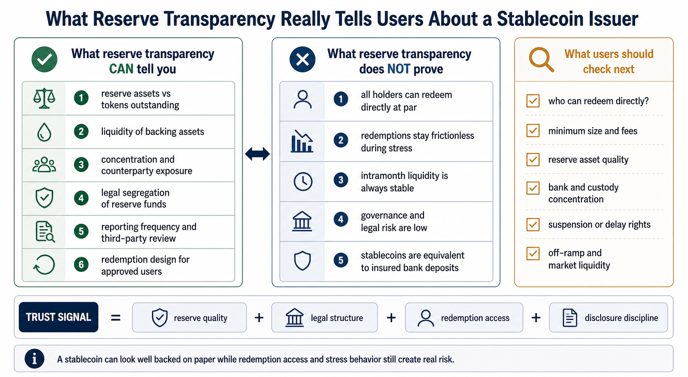

# What Reserve Transparency Really Tells Users About a Stablecoin Issuer

Stablecoin reserve transparency tells you whether an issuer looks more like a credible cash-equivalent operator or a fragile promise manager. It helps you judge backing quality, liquidity, counterparty exposure, and redemption design, but it does not remove legal, operational, or governance risk.

That distinction matters because many stablecoin users ask the wrong first question.

They ask, "Is this stablecoin backed?"

The better question is: **backed by what, held where, reported how often, and redeemable by whom under what conditions?**

As of **June 2026**, that is the real trust framework for large fiat-backed stablecoins.

*Editorial explainer: reserve transparency helps users judge backing quality and redemption design, but it does not by itself remove legal, operational, or stress-event risk.*

> **Summary callout:** A stablecoin can look well backed on paper while redemption access, stress liquidity, and legal structure still create real risk. A reserve **attestation** is also narrower than a full **audit** of the issuer.

## Quick Answer

If you only need the short version, this is it:

Reserve transparency can tell you six important things about a stablecoin issuer:

1. whether reported reserve assets cover outstanding tokens at a specific date
2. how liquid and credit-safe those reserve assets appear to be
3. how much counterparty and concentration risk sits inside the reserve structure
4. whether reserves appear segregated from the issuer's operating funds
5. how serious the issuer is about regular disclosures and third-party examination
6. whether a stablecoin is more likely to hold up under redemption pressure

Reserve transparency does **not** tell you everything:

1. it does not guarantee that all holders can redeem directly at par
2. it does not eliminate intramonth liquidity or operational stress
3. it does not guarantee that redemptions will stay frictionless during a crisis
4. it does not remove legal, compliance, custody, or governance risk
5. it does not make a stablecoin equivalent to insured bank deposits or central bank money

One important distinction should come early: a reserve **attestation** usually tests management's claims about reserve assets and liabilities at specific dates, while a full **audit** is broader and does not mean the same thing.

## Best Fit / Not Ideal For

**Best fit for:**

1. users deciding whether to hold large balances in a fiat-backed stablecoin
2. treasury teams evaluating which stablecoin to use for settlement or working capital
3. DeFi protocols deciding which stablecoin is safe enough to rely on as collateral or liquidity
4. analysts trying to separate peg stability from issuer quality

**Not ideal for:**

1. users who only care about a short-term DEX price dislocation and not issuer design
2. readers looking for a generic "best stablecoin" ranking
3. people assuming a reserve report alone settles every legal and operational risk question

## Stablecoin Reserve Transparency at a Glance

| Question | What it tells you | What it does not tell you |
| --- | --- | --- |
| Are reserves large enough? | Whether reported assets match or exceed tokens outstanding at a point in time | Whether that remains true every day between reports |
| What are reserves made of? | Liquidity, duration, and credit quality of the backing | Whether those assets can be mobilized instantly in every stress scenario |
| Who holds the reserves? | Counterparty exposure and concentration patterns | Whether a banking or custody shock will be painless |
| Are reserves segregated? | Whether user backing appears ring-fenced from corporate funds | Whether insolvency treatment will be simple in every jurisdiction |
| Who can redeem? | Whether direct access to par redemption exists | Whether most retail holders can actually use that route |
| How often is data updated? | The issuer's transparency discipline | The issuer's full real-time risk position |

## Key Takeaways

1. Reserve transparency is not a marketing extra. It is one of the clearest signals of issuer quality.
2. The most important reserve question is not only size. It is liquidity under stress.
3. Redemption rights matter as much as reserve composition because a stablecoin can look sound on paper while access to par is limited.
4. Monthly or quarterly reserve reports and attestations are useful, but they are snapshots, not continuous proof.
5. The strongest trust setup combines liquid assets, clear legal segregation, direct redemption rights, and frequent third-party reviewed disclosure.

## Why Reserve Transparency Matters Beyond "Is It Backed?"

The original value of reserve transparency is not that it gives users a comforting PDF.

Its real value is that it helps users estimate **conversion confidence**.

A fiat-backed stablecoin only works as money-like infrastructure if users believe it can be converted back into fiat at or near par, quickly enough, by enough market participants, under normal conditions and during stress.

That means reserve transparency is not really a disclosure topic alone. It is a **redemption-risk topic**.

The Federal Reserve has made this logic explicit. In an [October 16, 2025 speech](https://www.federalreserve.gov/newsevents/speech/barr20251016a.htm), Vice Chair Michael Barr said stablecoins are vulnerable to runs because they are redeemable on demand at par while backed by noncash assets, and because stablecoin issuers do not have deposit insurance or central bank liquidity.

So when users read a reserve report, they should not read it like a branding document.

They should read it like a stress document.

## What Reserve Transparency Actually Tells You

### 1. Whether backing appears sufficient at the report date

The first thing reserve transparency tells you is simple but essential: does the issuer report reserve assets at least equal to liabilities from outstanding tokens?

That is the minimum threshold, not the full trust test.

For example, Tether's transparency page says that as of **March 31, 2026**, it reported **$191.77 billion** in total assets against **$183.54 billion** in total liabilities, with **$8.23 billion** in net equity. Circle's USDC pages say that as of **June 8, 2026**, USDC had about **$75.9 billion** in circulation and corresponding USD reserves.

This matters because some stablecoin discussions still blur together three different ideas:

1. token price near $1 on secondary markets
2. issuer claim of 1:1 backing
3. demonstrated reserve sufficiency at a dated reporting point

Those are not the same thing.

### 2. How liquid the reserve looks under pressure

Not all reserve assets are equal.

If a reserve is mostly cash, short-dated Treasuries, reverse repos against Treasuries, or government money market fund holdings, that generally tells users the issuer is prioritizing liquidity and lower credit risk over yield.

If a reserve includes longer-duration assets, riskier credit exposure, opaque "other investments," affiliated lending, or harder-to-sell positions, the reserve may still cover liabilities on paper while becoming more fragile in a run scenario.

This is why asset composition matters more than the headline phrase "fully backed."

The Federal Reserve's [April 8, 2026 note on stablecoins in 2025](https://www.federalreserve.gov/econres/notes/feds-notes/stablecoins-in-2025-developments-and-financial-stability-implications-20260408.html) made the same point directly: stablecoins with safer and more liquid reserve composition exhibited lower run risk and relatively stronger adoption.

As of the most recent public data:

1. Tether said **73.64%** of its reserve sat in "Cash & Cash Equivalents & Other Short-Term Deposits" as of **March 31, 2026**
2. within that bucket, Tether said **82.87%** was in U.S. Treasury bills and **13.69%** in overnight reverse repo
3. Circle says the majority of USDC reserves are invested in the Circle Reserve Fund, an SEC-registered **2a-7 government money market fund**, with the rest held in cash-equivalent structures such as deposits and Treasury-related positions

That does not prove the issuers are risk-free. It does tell users a lot about the issuer's reserve philosophy.

### 3. Where counterparty and concentration risk sit

Reserve transparency also tells you where the issuer depends on banks, custodians, funds, and short-term market plumbing.

Even high-quality assets are still held through institutions.

That means users should ask:

1. how much reserve sits as direct bank deposits?
2. how concentrated are those deposits?
3. how much relies on one fund vehicle or one custody structure?
4. does the issuer disclose enough detail to understand those dependencies?

This question became much more concrete after the USDC stress episode tied to Silicon Valley Bank in **March 2023**. In its [December 17, 2025 note on the SVB episode](https://www.federalreserve.gov/econres/notes/feds-notes/in-the-shadow-of-bank-run-lessons-from-the-silicon-valley-bank-failure-and-its-impact-on-stablecoins-20251217.html), the Federal Reserve described stablecoins as run-able liabilities and showed how stress around banking access and primary market functioning can spill quickly into secondary market pricing.

The lesson is important: a reserve can be mostly high quality and still face market stress if users worry about access, timing, or concentrated counterparties.

### 4. Whether the reserve appears ring-fenced from corporate funds

A reserve report also helps users evaluate whether the backing is merely "owned somewhere by the company" or held specifically for token holders.

That legal distinction matters more than many users realize.

Paxos has repeatedly emphasized that its regulated stablecoin reserves are held in **bankruptcy remote, fully segregated accounts**, and the New York Department of Financial Services requires reserve assets and redemption structures consistent with that model for supervised U.S. dollar-backed stablecoins.

Circle's public reserve reporting has also described reserve assets as held on behalf of USDC holders, and its reserve documentation has explained that segregated accounts are kept apart from general corporate funds.

This does not mean every insolvency question is trivial. It does mean users should treat legal segregation as a core trust variable rather than a footnote.

### 5. Who really has access to redemption at par

This is one of the most important points in the entire article.

Reserve transparency is most useful when paired with redemption transparency.

The Federal Reserve's [February 23, 2024 note on primary and secondary markets](https://www.federalreserve.gov/econres/notes/feds-notes/primary-and-secondary-markets-for-stablecoins-20240223.html) explains why: direct customers of an issuer can arbitrage between the primary market and secondary market, but most retail users rely on secondary markets and do not have the same redemption access.

That means a stablecoin can be well-backed while many users still cannot personally redeem it 1:1 with the issuer on demand.

Circle states in its USDC Terms that:

1. **Users Type B are not customers of Circle**
2. users may not redeem USDC with Circle unless they open a **Circle Mint** account
3. **only Users Type A** can redeem USDC directly with Circle
4. USDC is **not subject to deposit insurance protection**

Tether's public materials also show practical redemption friction. Its knowledge-base material says the **minimum redemption amount is 100,000 USD equivalent**, and its fees page says digital-token withdrawal requests may take **several days** to process. Tether's legal terms also say access to services, including redemption, may be delayed or suspended under specified conditions.

This is why "redeemable at par" should never be treated as a blanket retail promise without reading the actual terms.

### 6. How serious the issuer is about disclosure discipline

Not all transparency is equally useful.

Users should care about:

1. reporting frequency
2. reporting scope
3. whether a third party examines management's assertions
4. whether the report breaks reserves down by asset class
5. whether the issuer discloses legal and operational limitations alongside reserve numbers

The NYDFS stablecoin guidance remains one of the clearest official benchmarks. It expects supervised dollar-backed stablecoins to have:

1. reserves with market value at least equal to outstanding coins at end of day
2. clear redemption rights at par for lawful holders, subject to onboarding and compliance
3. reserve assets limited to safer categories such as Treasuries, government money market funds, and deposit accounts under restrictions
4. monthly CPA attestations that include asset-class breakdowns and reserve adequacy checks

That benchmark is useful because it shows what "good transparency" looks like in practice: not just a total-assets number, but a governed reporting framework tied to reserve quality and redeemability.

## What Reserve Transparency Does Not Tell You

Reserve transparency is necessary, but it is not enough.

### 1. It does not give you continuous real-time certainty

A monthly or quarterly report is a snapshot.

Tether itself says its reserve reports are published for transparency purposes only, are not financial statements, and contain selected financial information as of a specific date. That does not make the reports useless. It means users should not overread them.

A report can be accurate at month-end while the issuer's intramonth liquidity posture changes materially.

### 2. It does not guarantee smooth redemptions during stress

Even if reserve assets are ultimately money-good, stablecoins can still trade below par if the market doubts access, timing, or operational continuity.

That was one of the key lessons of the USDC weekend in **March 2023**: secondary market price can reflect stress about redemption pathways before reserve losses are fully realized or even if losses do not ultimately impair all backing.

### 3. It does not eliminate governance and related-party risk

A reserve report may tell you what assets are there. It may tell you less about:

1. who makes risk decisions
2. whether affiliated entities create hidden dependencies
3. whether the issuer has incentives to stretch for yield
4. how legal or compliance actions could disrupt access

This is one reason official commentary keeps returning to run risk and interconnectedness rather than reserve size alone.

### 4. It does not make a stablecoin the same as bank money

Governor Barr's October 2025 remarks are useful here again: stablecoins do not come with deposit insurance and issuers do not have access to central bank liquidity.

That means even a well-run fiat-backed stablecoin is still a private issuer liability with a specific legal and operational design. It is not just "digital cash" in the same sense as money in an insured bank account.

## What This Looks Like in Real Issuer Design

The easiest way to understand reserve transparency is to compare how different issuers expose different layers of risk.

### Example 1: Circle shows strong reserve design, but direct redemption is still gated

Circle's current public positioning is clear:

1. USDC is fully backed by highly liquid cash and cash-equivalent assets
2. the majority of the reserve sits in the Circle Reserve Fund, an SEC-registered 2a-7 government money market fund
3. Circle publishes monthly reserve attestations by a Big Four accounting firm
4. as of **June 8, 2026**, Circle showed about **$75.9 billion** USDC in circulation

That is meaningful transparency.

But Circle's legal terms add an equally important nuance: not every holder can redeem directly with Circle. Direct redemption is tied to Circle Mint account access and Type A user status.

That combination shows what good analysis looks like. A reserve report can support confidence in backing quality while still leaving access asymmetry between institutional and non-institutional users.

### Example 2: Tether shows why reserve composition and redemption access must be read together

Tether's transparency page gives more numerical detail than many critics imply. As of **March 31, 2026**, it disclosed total assets, total liabilities, net equity, and reserve composition percentages.

That tells users a lot.

But it does not by itself answer the user-level question, "Can I personally get out at par smoothly under stress?"

For that, users also need to read the redemption process:

1. the minimum redemption amount is **100,000 USD equivalent**
2. redemption and withdrawal processing may take time
3. terms allow suspension or delay under specified circumstances

This is the core lesson of the article: reserve transparency without redemption transparency is incomplete risk analysis.

### Example 3: Paxos and NYDFS offer a benchmark for what "high-discipline" transparency looks like

Paxos and the NYDFS guidance matter because they show a clearer institutional model for dollar-backed stablecoins:

1. reserve assets constrained to safer categories
2. legal segregation and bankruptcy remoteness as a design principle
3. clear supervision and attestation expectations
4. published statements around par redemption rights

Users do not need to believe one issuer is perfect to learn from this framework. The value is that it gives a more demanding benchmark than vague claims of being "fully backed."

## A Simple Decision Framework

If you want to judge whether reserve transparency is actually good enough, use these eight questions.

### 1. Is the reserve report a snapshot or a reporting system?

One PDF per month is better than nothing. A real transparency system includes recurring reports, clear methodology, and third-party reviewed data.

### 2. What assets make up the reserve?

Look for cash, short-dated Treasuries, government money market fund exposure, and limited credit or duration risk. Treat vague "other investments" with caution.

### 3. Are the reserves legally segregated?

If the issuer does not explain whether reserve assets are held for token holders and separated from corporate funds, that is a meaningful trust gap.

### 4. Who can redeem directly at par?

If only a narrow set of approved institutional users can redeem, retail holders are relying more heavily on secondary-market liquidity than many realize.

### 5. What are the operational frictions?

Check minimum size, fees, onboarding requirements, timing, cut-off windows, and whether the issuer reserves rights to delay or suspend.

### 6. How concentrated are counterparties?

Ask where bank exposure, fund exposure, custody exposure, and settlement dependencies are clustered.

### 7. What does the report leave out?

If there is no asset-class breakdown, no legal explanation, or no discussion of redemption conditions, the transparency may be too shallow to rely on.

### 8. How would this behave under stress, not just at rest?

The trust test is not whether the report looks clean on a normal day. It is whether the reserve and redemption structure would still look credible during a banking shock, compliance disruption, or market run.

### Practical rule of thumb

Reserve transparency is a strong positive signal when:

1. reserves are mostly in high-quality, short-duration assets
2. reports are frequent and third-party reviewed
3. reserves appear segregated for token holders
4. redemption terms are clear and realistic
5. reserve and redemption design reinforce each other

Reserve transparency is not enough on its own when:

1. asset categories are vague
2. redemption access is narrow or highly conditional
3. operational suspension rights are broad
4. disclosures are infrequent or too limited in scope
5. users confuse secondary-market liquidity with guaranteed direct redemption

## Bottom Line

Reserve transparency does not tell you whether a stablecoin issuer is perfect.

It tells you whether the issuer is showing you enough of the balance-sheet and redemption design to deserve serious trust.

In **2025-2026**, the stablecoin market is large enough that vague claims of being "fully backed" are no longer good enough. Users should expect to know what backs the token, how liquid that backing is, where it sits, who can redeem against it, and what frictions or limits apply.

So when you read a stablecoin reserve report, do not stop at the headline number.

Ask what it implies about redemption risk.

That is what reserve transparency really tells you about a stablecoin issuer.

## FAQ

### Is an attestation the same as a full audit of the issuer?

Not necessarily. A reserve attestation usually examines management's assertions about reserve assets and liabilities at specific dates. That is narrower than a full audit of the entire issuer and its total risk profile.

### Why does redemption access matter if reserves are good?

Because most users care about actual exit paths, not only theoretical backing. If direct redemption is limited to approved institutions or large minimums, retail users depend more on secondary markets.

### Does a stablecoin trading near $1 prove the issuer is safe?

No. Secondary-market price can stay near par for many reasons, including arbitrage and liquidity conditions. It is useful, but it is not the same as reading reserve quality and redemption structure.

### What reserve assets are usually safer for fiat-backed stablecoins?

Generally, cash, short-dated U.S. Treasuries, Treasury reverse repo, and government money market fund exposure are viewed as safer than riskier credit assets or opaque investment buckets.

### What is the single biggest mistake users make?

Treating reserve transparency as a yes-or-no question. The better approach is to ask whether disclosure, asset quality, legal structure, and redemption access work together.

## Source Notes

The analysis above is based primarily on official materials from:

1. [Circle: USDC](https://www.circle.com/usdc)
2. [Circle: Transparency & Stability](https://www.circle.com/transparency)
3. [Circle: USDC Terms](https://www.circle.com/legal/usdc-terms)
4. [Tether: Transparency](https://tether.to/transparency/?tab=reports)
5. [Tether: Legal Terms](https://tether.to/en/legal/)
6. [Tether: How to redeem Tether tokens to fiat currency](https://tether.to/en/redeem-tethers-to-fiat-currency/)
7. [Tether: Fees](https://tether.to/en/fees/)
8. [NYDFS: Guidance on the Issuance of U.S. Dollar-Backed Stablecoins](https://www.dfs.ny.gov/industry_guidance/industry_letters/il20220608_issuance_stablecoins)
9. [Paxos: USDP Transparency Reports](https://www.paxos.com/usdp-transparency)
10. [Paxos: Regulated stablecoin overview](https://docs.paxos.com/guides/stablecoin/index)
11. [Paxos: Full monthly reserve holdings and bankruptcy-remote disclosure](https://www.paxos.com/newsroom/paxos-leads-digital-asset-industry-by-becoming-first-issuer-to-disclose-full-monthly-reserve-holdings-backing-usdp-and-busd-regulated-stablecoins)
12. [Federal Reserve: Primary and Secondary Markets for Stablecoins](https://www.federalreserve.gov/econres/notes/feds-notes/primary-and-secondary-markets-for-stablecoins-20240223.html)
13. [Federal Reserve: Stablecoins in 2025](https://www.federalreserve.gov/econres/notes/feds-notes/stablecoins-in-2025-developments-and-financial-stability-implications-20260408.html)
14. [Federal Reserve: In the Shadow of Bank Runs](https://www.federalreserve.gov/econres/notes/feds-notes/in-the-shadow-of-bank-run-lessons-from-the-silicon-valley-bank-failure-and-its-impact-on-stablecoins-20251217.html)
15. [Speech by Governor Barr on stablecoins, October 16, 2025](https://www.federalreserve.gov/newsevents/speech/barr20251016a.htm)

## Suggested Internal Links

1. `What Stablecoin Settlement Rails Actually Change for Cross-Border Payments`
2. `How Stablecoin Regulation Changes Payment, Redemption, and Issuer Competition`
3. `What Happens When a Protocol Depends Too Heavily on One Stablecoin Rail`
4. `What a Stablecoin Depeg Does to Users, LPs, and Collateral Markets`
