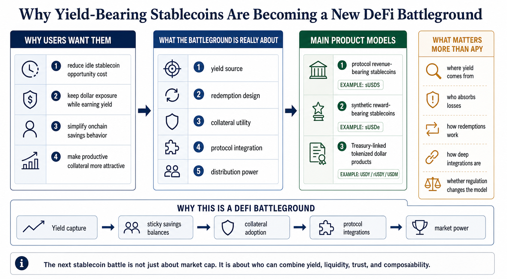

# Why Yield-Bearing Stablecoins Are Becoming a New DeFi Battleground

Yield-bearing stablecoins are changing the stablecoin game from a pure distribution contest into a yield, collateral, and protocol-control contest. The question is no longer only which dollar token gets used. It is increasingly which dollar token lets users keep more yield while still remaining liquid, composable, and credible under stress.

That is why this category matters.

A normal stablecoin competes on liquidity, trust, and settlement utility. A yield-bearing stablecoin tries to do all of that while also answering a harder user demand: **why should I hold a non-yielding digital dollar when onchain alternatives can pay me to stay?**

As of **June 2026**, that question sits at the center of a new DeFi battlefront.

> **Summary callout:** Yield-bearing stablecoins are not all the same product. Some pass through Treasury income, some route protocol revenue, and some depend on synthetic carry or basis-style mechanics. The battleground is not just yield level. It is yield source, redemption design, collateral utility, and distribution power.

*Editorial explainer: the next stablecoin battle is not just about market cap. It is about who can combine yield, liquidity, trust, and composability.*

## Quick Answer

If you only need the short version, this is it:

Yield-bearing stablecoins are becoming a DeFi battleground for five main reasons:

1. they turn idle stablecoin balances into productive balances
2. they move competition from simple issuance toward yield distribution
3. they create new incentives for protocols to choose one stablecoin rail over another
4. they can become preferred collateral if users value both stability and carry
5. they blur the line between payments money, savings product, and onchain collateral

They also create harder market-structure questions:

1. where does the yield actually come from?
2. who absorbs losses or negative carry?
3. can the asset stay liquid while paying yield?
4. how usable is it as collateral across lending, trading, and payments?
5. how much regulation or onboarding friction comes with the yield?

One important distinction should come early: the market calls many products "yield-bearing stablecoins," but some are better understood as tokenized notes, savings wrappers, or reward-bearing versions of a base stablecoin rather than as a single unified asset category.

## Best Fit / Not Ideal For

**Best fit for:**

1. readers trying to understand where stablecoin competition is going next
2. DeFi users comparing non-yielding stables with productive dollar assets
3. protocol teams deciding what collateral or settlement assets to integrate
4. treasury managers evaluating whether yield-bearing stables are worth the extra complexity

**Not ideal for:**

1. readers looking for a simple APY ranking
2. users who only want a basic stablecoin explainer with no market-structure angle
3. anyone assuming every yield-bearing stablecoin has the same risk model

## Yield-Bearing Stablecoins at a Glance

| Model | Example | Where the yield comes from | What users gain | What users give up |
| --- | --- | --- | --- | --- |
| Protocol revenue-bearing stablecoin | sUSDS | Sky Savings Rate backed by protocol revenue and governed allocations | Native yield on a DeFi dollar rail | governance and protocol-execution risk |
| Synthetic reward-bearing stablecoin | sUSDe | protocol revenue from Ethena's backing and hedging structure | potentially high capital efficiency and broad DeFi utility | more complex market and strategy risk |
| Treasury-linked tokenized dollar product | USDY / rUSDY, USDM | short-term Treasuries and cash-equivalent reserve income | exposure to real-world dollar yield | more legal, onboarding, or redemption constraints |

## Key Takeaways

1. The stablecoin market is no longer only competing on settlement and liquidity. It is competing on who captures and redistributes yield.
2. Yield-bearing stablecoins are powerful because they reduce the opportunity cost of holding dollars onchain.
3. The biggest differentiation is not the APY headline. It is the source and sustainability of the yield.
4. Integration into lending markets, collateral systems, and yield venues is what turns a productive stablecoin into a real market-structure force.
5. Some products win on openness and DeFi composability, while others win on regulatory clarity or real-world asset backing. Few win cleanly on every axis.

## Why This Category Matters Beyond APY

The original value of yield-bearing stablecoins is not simply that they offer "more return."

Their deeper value is that they change the economics of holding stable assets onchain.

For years, many users held stablecoins mainly for three reasons:

1. to settle trades
2. to park capital defensively
3. to bridge between centralized and decentralized venues

The problem is that a non-yielding stablecoin creates a visible opportunity cost when Treasury yields, protocol revenue, or hedged basis-style returns are available elsewhere.

Yield-bearing stablecoins try to internalize that missing return at the token layer.

That is why this category matters strategically. It is not just a new product shelf. It is an attempt to make the stablecoin itself the place where yield capture begins.

## Why Yield-Bearing Stablecoins Are Becoming a Battleground

### 1. They attack the "idle dollar" problem

A plain stablecoin can be highly useful and still economically dead weight when it sits unused in a wallet.

Yield-bearing stablecoins promise to reduce that idle-cash penalty. Instead of forcing users to move funds into a separate vault, money market, or lending position, they try to let the token itself accrue value.

Sky says this directly in its sUSDS material. As of **June 2026**, Sky describes sUSDS as the world's largest yield-generating stablecoin, with **$18.56 billion** in supply and a **4.00% APY**, and positions it as direct access to the Sky Savings Rate.

That is a meaningful market-structure shift because a user deciding between USDS and sUSDS is not only deciding between two token tickers. The user is deciding whether to hold idle dollars or productive dollars.

### 2. They move stablecoin competition from issuance to yield distribution

Once yield lives at the token layer, stablecoin competition changes.

The winner is no longer only the issuer with the deepest exchange liquidity or the largest payments network. The winner may be the issuer or protocol that can:

1. generate the most credible yield
2. pass through the largest share of that yield to holders
3. preserve enough liquidity and composability to remain useful

Sky leans into this point by highlighting that sUSDS avoids third-party "yield haircuts" and passes through the native Sky Savings Rate. Ethena leans into a different version of the same battle by positioning sUSDe as a reward-bearing digital dollar and emphasizing broad integration across venues such as Aave, Morpho, and Pendle.

The battle is not just who issues the stablecoin. It is who gets to keep the economic spread around it.

### 3. They turn collateral markets into distribution channels

A stablecoin becomes much more powerful when it is not just held, but also accepted as collateral.

That is why integrations matter so much.

Ethena's main site says USDe and sUSDe are integrated across major DeFi venues, and specifically notes use across Aave, Morpho, and Pendle. This matters because once a yield-bearing stablecoin is accepted as supply or collateral, its distribution no longer depends only on spot trading or direct minting.

It starts spreading through:

1. lending markets
2. leveraged carry trades
3. principal-token and yield-token systems
4. structured strategies built on top of it

At that point the stablecoin becomes infrastructure, not just an asset.

### 4. They create a new fight over who owns the savings layer

Stablecoins used to be mostly about transactional utility.

Yield-bearing stablecoins push them toward the savings layer.

That is a major strategic shift because the savings layer is sticky. If users park capital in a productive stablecoin, they are less likely to rotate back into a non-yielding one unless the yield advantage disappears or trust breaks down.

This is why the competition is intensifying between:

1. protocol-native savings assets such as sUSDS
2. synthetic reward-bearing dollars such as sUSDe
3. Treasury-linked tokenized dollar products such as USDY/rUSDY or, previously, USDM

Each one is trying to answer the same user need with a different trust stack.

### 5. They force protocols to choose between openness, compliance, and capital efficiency

Not every yield-bearing stablecoin is equally easy to integrate everywhere.

Some are open and deeply composable but rely on more complex risk engines. Some are built around regulated reserve structures but come with jurisdictional or onboarding constraints.

Ondo's USDY docs make this tradeoff very clear. USDY is described as a tokenized note designed to combine stablecoin-like accessibility with high-quality dollar yield, but the docs also say it is accessible to qualifying non-US investors and includes specific redemption pathways, network differences, and minimums for some cross-chain minting and redemption routes.

Mountain Protocol's USDM illustrated the other side of this tradeoff. Mountain positioned USDM as a permissionless yield-bearing stablecoin backed by short-term Treasuries in bankruptcy-remote reserves. But on **May 12, 2026**, Mountain began an orderly USDM wind-down, citing the evolving U.S. regulatory landscape, and said the reward rate would be set to **0%** during Phase 2 beginning **June 12, 2026**.

That is a critical market signal. In yield-bearing stablecoins, product design alone is not enough. Distribution and regulation can determine whether the model survives at scale.

## What Really Differentiates One Yield-Bearing Stablecoin From Another

### 1. The source of yield

The cleanest first question is: where does the return come from?

There are at least three broad models in the market:

1. **real-world rate pass-through**
2. **protocol revenue pass-through**
3. **synthetic or hedged carry-based revenue**

Sky's sUSDS says yield comes from protocol revenue generated by the Sky Agent Network across governance-approved allocations. Ondo's USDY and Mountain's USDM materials center the yield on short-term Treasuries and cash-equivalent reserve structures. Ethena says sUSDe rewards come from protocol revenue connected to the USDe backing mechanism, with published explanations for how rewards are distributed and how the reserve fund absorbs periods of negative protocol revenue.

The closer users get to the actual yield source, the better they can judge durability.

### 2. The token mechanics

How a product expresses yield matters almost as much as the yield source.

Some yield-bearing stablecoins rebase. Some increase redemption price over time. Some use a vault-style ratio that makes the claim on the base asset grow.

Ondo's docs are especially clear here:

1. **USDY** is an accumulating token whose price rises over time
2. **rUSDY** is a rebasing token that keeps a $1 token price while balances increase

Mountain described USDM as a rebasing ERC-20 token. Ethena's docs describe sUSDe as a reward-bearing token-vault mechanism where the USDe value of sUSDe increases as rewards are deposited in the staking contract.

These design choices affect:

1. wallet UX
2. tax treatment in some jurisdictions
3. compatibility with smart contracts
4. how easily the asset can function as collateral or settlement

### 3. The redemption and access model

Yield is only as credible as the path back out.

Treasury-linked or regulated products often come with more explicit onboarding, jurisdiction, or minimum-size conditions. More open DeFi-native products may be easier to access but shift users into a different risk stack.

This is one reason the category is a battleground rather than a winner-take-all market. Each product is choosing a different tradeoff between openness and controlled redemption.

### 4. The integration surface

A yield-bearing stablecoin becomes strategically important when it works across:

1. DEX liquidity
2. lending markets
3. collateral systems
4. structured yield venues
5. payments or treasury workflows

Ethena's official site explicitly highlights integrations across Aave, Morpho, and Pendle. Sky is already extending the savings layer further: on **June 4, 2026**, Sky introduced "Fixed Yield" on top of sUSDS through Pendle v2, showing how one productive stablecoin can become the base layer for another yield product.

That is exactly what a battleground looks like. One product is no longer just competing for holders. It is competing to become a platform others build on.

## What Yield-Bearing Stablecoins Do Not Solve

This category is strategically important, but it does not make tradeoffs disappear.

### 1. Higher yield does not erase liquidity risk

A productive stablecoin still needs secondary-market depth, reliable redemptions, and enough market confidence to keep users comfortable in stress periods.

### 2. Stablecoin yield is not one risk category

Treasury pass-through, protocol revenue, and synthetic carry are not interchangeable.

A user comparing APYs without comparing yield engines is not doing real analysis.

### 3. Regulation can overtake product design

USDM's wind-down is a good reminder that even a product built around Treasury backing, transparency, and permissionless transfer can still be constrained by the regulatory perimeter around it.

### 4. Composability can amplify both adoption and fragility

The more a yield-bearing stablecoin gets embedded across collateral loops and structured products, the more strategically powerful it becomes. But that same success can make unwind behavior sharper if trust weakens.

## What This Looks Like in Real Market Structure

The easiest way to understand the battleground is to look at three different strategic models.

### Example 1: Sky is fighting to own the native DeFi savings rail

Sky is not only offering a stablecoin. It is offering a native savings stack around that stablecoin.

As of **June 2026**, Sky says:

1. sUSDS supply is **$18.56 billion**
2. the Sky Savings Rate is **4.00% APY**
3. the rate is variable and governed by SKY token holders

This is a powerful competitive position because it keeps more of the savings logic inside the protocol's own monetary system.

### Example 2: Ethena is fighting to own the high-productivity synthetic dollar lane

Ethena's strategy is different.

Its official materials emphasize:

1. reward-bearing digital dollar positioning
2. integration across major DeFi venues
3. a reserve fund intended to absorb periods of negative protocol revenue so sUSDe holders receive only positive or flat rewards
4. deep compatibility with yield venues such as Pendle

That makes Ethena's battleground less about Treasury pass-through and more about capital efficiency, distribution, and synthetic-dollar dominance.

### Example 3: Ondo shows why treasury-linked yield products compete through structure, not just yield

Ondo's USDY/rUSDY stack highlights another strategic lane.

USDY is designed for qualifying non-US users and is framed as a tokenized note with high-quality dollar-denominated yield. rUSDY then adapts that exposure into a rebasing format that is better suited for yield-bearing exchange or settlement use.

This matters because it shows how the battle is not just "who pays more." It is "who packages real-world yield into a format DeFi and global users can actually use."

## A Simple Decision Framework

If you want to judge whether a yield-bearing stablecoin is strategically strong, use these eight questions.

### 1. Where does the yield come from?

Treasuries, protocol revenue, and synthetic carry are different engines with different failure modes.

### 2. Is the yield native or subsidized?

If the rate depends on token emissions or short-term incentives, it may not represent durable product strength.

### 3. Does the token work well as collateral?

A productive stablecoin becomes much more important if it can also function in lending, leverage, and structured products.

### 4. Is the yield expression compatible with real usage?

Rebasing, price-accreting, or vault-ratio designs each create different UX and integration tradeoffs.

### 5. How open is access?

Jurisdictional limits, KYC requirements, minimums, and direct redemption rules shape how big the product can actually get.

### 6. Can the product survive lower rates or negative carry?

The more a product depends on one favorable market regime, the more fragile its competitive edge may be.

### 7. How deep is the integration surface?

A yield-bearing stablecoin that is only held is less defensible than one embedded in DEXs, lending markets, yield venues, and treasury workflows.

### 8. Who captures the spread?

The strategic winner is often the product that can pass enough value to holders while still leaving enough economics for the issuer, protocol, or ecosystem to keep expanding.

### Practical rule of thumb

Yield-bearing stablecoins are strongest when:

1. the yield source is legible and credible
2. the token design fits real DeFi and wallet usage
3. redemptions or exit paths are clear enough
4. integration across collateral and liquidity venues is deep
5. the rate is high enough to matter but not so high that it looks structurally fragile

They are weaker when:

1. the APY is easy to market but hard to explain
2. the product is productive but hard to use
3. access is narrow and distribution is shallow
4. one regulatory or market shift can wipe out the core advantage

## Bottom Line

Yield-bearing stablecoins are becoming a DeFi battleground because they answer a simple but powerful user demand: let me keep my dollar exposure without giving up all the yield around it.

In **2025-2026**, that has turned stablecoin competition into a battle over who owns the savings layer, who controls the collateral layer, and who can package yield without breaking trust, liquidity, or regulatory viability.

The next phase of stablecoin competition will not be won only by the token with the biggest market cap.

It will be won by the token stack that makes yield, liquidity, and utility fit together best.

## FAQ

### Are yield-bearing stablecoins always safer than putting a stablecoin in a vault?

No. Sometimes they simplify the user experience, but the risk depends on the underlying yield engine, redemption design, and legal or protocol structure.

### Why is this a battleground and not just another product category?

Because these assets compete for stablecoin balances, collateral usage, protocol integrations, and savings behavior all at once.

### Is a Treasury-backed yield token the same as a synthetic yield-bearing stablecoin?

No. Treasury-backed products and synthetic products may both look like productive dollars, but they rely on different assets, counterparties, and stress assumptions.

### Why do integrations with Aave, Morpho, or Pendle matter so much?

Because that is where a yield-bearing stablecoin stops being a passive holding and becomes embedded financial infrastructure.

### What is the biggest analytical mistake people make here?

Comparing APYs without comparing yield source, exit path, and integration depth.

## Source Notes

The analysis above is based primarily on official materials from:

1. [Sky: sUSDS](https://sky.money/susds)
2. [Sky blog: Fixed Yield on sUSDS, June 4, 2026](https://sky.money/blog/what-is-fixed-yield)
3. [Ethena main site](https://ethena.fi/)
4. [Ethena: Rewards Mechanism Explanation](https://docs.ethena.fi/solution-overview/protocol-revenue-explanation/rewards-mechanism-explanation)
5. [Ethena: sUSDe Rewards Mechanism](https://docs.ethena.fi/solution-overview/protocol-revenue-explanation/susde-rewards-mechanism)
6. [Ondo: USDY Basics](https://docs.ondo.finance/general-access-products/usdy/basics)
7. [Mountain Protocol docs](https://docs.mountainprotocol.com/)
8. [Mountain Protocol: USDM Wind-Down Overview](https://docs.mountainprotocol.com/wind-down-documentation/usdm-wind-down-overview)

## Suggested Internal Links

1. Target: `What Stablecoin Settlement Rails Actually Change for Cross-Border Payments`
Anchor: `stablecoin settlement rails` or `payment and settlement utility`
Best placement: in sections distinguishing productive stablecoins from pure payment stablecoins

2. Target: `What Reserve Transparency Really Tells Users About a Stablecoin Issuer`
Anchor: `reserve transparency` or `issuer and redemption risk`
Best placement: in sections on trust stacks, yield source credibility, or differences between Treasury-backed and synthetic models

3. Target: `How Users Are Actually Using USDC and USDT for Real Payment Workflows`
Anchor: `real payment workflows` or `operational dollar use cases`
Best placement: in sections explaining why some users still prefer non-yielding stables for payroll, treasury, or settlement
