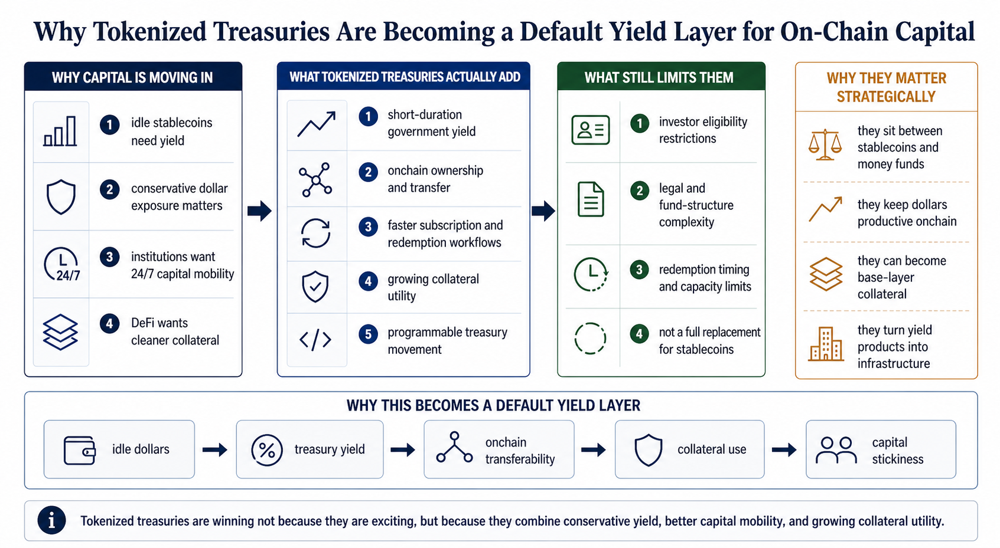

# Why Tokenized Treasuries Are Becoming a Default Yield Layer for On-Chain Capital

Tokenized treasuries are becoming a default yield layer for onchain capital because they solve a simple but important capital-allocation problem: large pools of dollar-like liquidity no longer want to sit idle if they can earn short-duration U.S. government yield while staying programmable, transferable, and increasingly usable as collateral.

That is the core shift.

For years, crypto users had to choose between three imperfect options:

1. hold stablecoins for liquidity but earn nothing
2. move into DeFi-native yield products and take more protocol or market risk
3. leave capital in traditional money-market structures that were harder to use onchain

Tokenized treasuries increasingly sit in the middle of that triangle.

As of **June 2026**, they are no longer just niche RWA wrappers. They are starting to look like a base-layer destination for conservative onchain dollar capital.

> **Summary callout:** Tokenized treasuries are not winning because they are exciting. They are winning because they give onchain capital something it badly wants: credible dollar yield, cleaner collateral, and more flexible settlement than traditional offchain fund plumbing.

*Editorial explainer: tokenized treasuries are winning because they combine conservative yield, better capital mobility, and growing collateral utility.*

## Quick Answer

If you only need the short version, this is it:

Tokenized treasuries are becoming a default yield layer for onchain capital because they combine five things that are difficult to get together elsewhere:

1. exposure to short-duration U.S. government yield
2. programmable onchain ownership and transfer
3. increasingly fast subscription and redemption workflows
4. growing use as collateral in trading and treasury systems
5. better fit for conservative capital than many DeFi-native yield products

They are also benefiting from a broader market shift:

1. stablecoin balances are too large to remain permanently idle
2. institutions want 24/7 capital mobility
3. DeFi venues want cleaner collateral than pure crypto exposure
4. tokenized fund structures are becoming easier to integrate into onchain workflows

One distinction should come early: not every tokenized treasury product is a pure stablecoin. Some are tokenized fund shares, some are tokenized notes, and some are money market fund representations with stricter investor eligibility, redemption, or transfer conditions than a conventional stablecoin.

## Best Fit / Not Ideal For

**Best fit for:**

1. readers trying to understand why RWA treasuries are attracting onchain capital
2. treasury managers comparing idle stablecoin balances with yield-bearing alternatives
3. DeFi users and protocols evaluating conservative collateral layers
4. anyone mapping how RWA and stablecoins increasingly overlap

**Not ideal for:**

1. readers looking for a simple APY ranking
2. anyone assuming tokenized treasuries are frictionless retail cash equivalents
3. users who want a purely legal or tax-focused explainer

## Tokenized Treasuries at a Glance

| Product type | Example | What users are really getting | Why it matters onchain | Main tradeoff |
| --- | --- | --- | --- | --- |
| Tokenized treasury fund exposure | OUSG, BENJI, USYC | fund or fund-like exposure to short-term government assets | stable yield with growing collateral and settlement utility | access, onboarding, or jurisdiction limits |
| Tokenized treasury note | USDY / rUSDY | yield-bearing dollar note linked to Treasury-heavy backing | easier bridge between stablecoin-like UX and RWA yield | not identical to a plain stablecoin or deposit |
| Tokenized money market collateral | USYC, BUIDL-linked collateral flows | yield-bearing collateral usable in trading and treasury workflows | lets institutions keep cash productive while staying liquid | more infrastructure and eligibility complexity |

## Key Takeaways

1. Tokenized treasuries are increasingly a yield layer, not just a representation layer.
2. Their biggest advantage is not yield alone. It is yield combined with transferability, programmability, and collateral use.
3. The strongest adoption is happening where treasury management, stablecoin infrastructure, and collateral markets overlap.
4. These products are strongest for conservative or institutional-style capital, not as universal retail money substitutes.
5. The strategic battle is shifting from "can Treasuries be tokenized?" to "which tokenized Treasury rails become the default dollar yield base for onchain finance?"

## Why This Category Matters Beyond "Putting Treasuries on a Blockchain"

The original value of tokenized treasuries is not that investors can hold a government asset in token form.

Their deeper value is that they make a traditionally static cash-management product usable inside an always-on financial environment.

Traditional money funds and Treasury products already offer conservative yield. The problem is that they were designed for banking hours, transfer agents, subscription windows, and slower collateral workflows.

Onchain capital wants something else:

1. continuous availability
2. faster settlement
3. programmable movement
4. integration into digital-asset treasury systems
5. more direct composability with exchanges, custodians, and protocols

That is what tokenized treasuries are increasingly trying to provide.

## Why Tokenized Treasuries Are Becoming a Default Yield Layer

### 1. They attack the idle-stablecoin problem from the conservative end

One of the biggest structural inefficiencies in crypto has been the amount of stablecoin and dollar-linked capital sitting idle.

Tokenized treasuries offer a straightforward answer: move some of that capital into short-duration government-yield products without fully leaving the onchain environment.

Ondo said on **January 23, 2026** that it had surpassed **$2.5 billion** in TVL across tokenized products, with **USDY** above **$1 billion** and **OUSG** above **$770 million**. Franklin Templeton said on **April 30, 2026** that the broader BENJI suite represented **$1.98 billion** in AUM as of **April 29, 2026**.

Those numbers matter because they show the use case is not theoretical anymore.

### 2. They let capital earn without fully giving up liquidity posture

The reason tokenized treasuries are becoming a "default yield layer" is not that they fully replace cash.

It is that they let capital stay closer to cash while still earning.

Circle's USYC page describes the product as a tokenized money market fund designed to provide institutional-grade, yield-bearing collateral with near-instant liquidity onchain. Circle says:

1. subscriptions and redemptions can happen onchain
2. redemptions below the instant-redemption capacity can settle in one block time
3. redemptions above that threshold settle **T+0** or **T+1**
4. the minimum investment is **$100,000**

That is a very different operating model from a legacy fund workflow.

### 3. They are increasingly usable as collateral, not just as parked assets

A yield layer becomes strategically important when it also becomes a collateral layer.

This is where tokenized treasuries are gaining real momentum.

Circle says USYC can be used as yield-bearing margin or cross-margin collateral on supported exchanges and lending desks. In **August 2025**, Circle said Binance institutional clients could use USYC as off-exchange collateral for derivatives trades.

Securitize's recent BUIDL announcements point in the same direction. In 2026, BlackRock's BUIDL, tokenized by Securitize, has been promoted not only as a tokenized fund but as collateral accepted on venues such as Binance, Crypto.com, and Deribit, while also expanding across additional blockchain share classes.

This is one of the clearest reasons the category matters. A tokenized Treasury product becomes much more powerful once it can secure positions, satisfy treasury requirements, and still earn.

### 4. They fit the risk appetite of conservative onchain capital

Not all onchain capital wants the same thing.

Some capital wants aggressive yield. Some wants neutral or hedged yield. Some just wants the risk-free or near risk-free rate in a format that is more operationally flexible than a bank account or offchain fund share.

Tokenized treasuries increasingly serve that third category.

That is why they are becoming a default layer for:

1. protocol treasuries
2. OTC and exchange collateral pools
3. institutional digital-asset treasury managers
4. users stepping up from plain stablecoins without stepping all the way into high-risk DeFi yield

### 5. They are becoming infrastructure, not just investment wrappers

The strongest signal in this market is not yield itself. It is infrastructure integration.

Franklin Templeton said on **April 30, 2026** that BENJI offers:

1. peer-to-peer transferability
2. daily onchain dividend distribution running **365 days a year**
3. intraday yield accrued by the second when tokens are transferred
4. near-instant settlement

Circle says USYC supports automated interactions through smart contracts and can sit inside broader onchain trading, treasury, and settlement workflows.

Ondo says OUSG supports **24/7** tokenized subscriptions and redemptions and is increasingly multi-chain.

Once these products behave like infrastructure components rather than static wrappers, adoption compounds.

## What Really Differentiates One Tokenized Treasury Product From Another

### 1. Investor access and legal structure

Some products are open only to qualifying non-U.S. or institutional investors. Some are structured as tokenized notes. Some represent fund shares. Some are more retail-accessible.

Ondo's docs state that USDY is accessible to qualifying non-U.S. individual and institutional investors. OUSG is framed as a qualified-access product. Circle says USYC is available only to non-U.S. persons, with additional eligibility restrictions possible.

That means access design is not a side issue. It is part of the product.

### 2. Redemption speed and operating model

A tokenized Treasury product with slow or narrow redemption may still be useful, but it will not become a default yield layer as easily.

Users care about:

1. how fast they can subscribe and redeem
2. whether redemptions are in fiat, stablecoins, or both
3. whether there are cut-off windows
4. whether liquidity is capped or tiered

Circle's USYC and Ondo's OUSG are both clearly leaning into this competition.

### 3. Collateral utility

Some products are mainly for holding yield.

Others are being optimized for trading and collateral workflows.

The latter group is more likely to become structurally important because they do not just absorb capital. They circulate through the capital stack.

### 4. Token mechanics and user experience

Some products accrue value through a rising token price. Some use a rebasing format. Some distribute yield in ways that change how they can be integrated into applications.

Ondo's docs make this explicit:

1. **USDY** is an accumulating token
2. **rUSDY** is a rebasing token that keeps a **$1.00** price

These mechanics affect wallet behavior, accounting, settlement integration, and collateral usability.

## What Tokenized Treasuries Do Not Solve

This category is powerful, but it does not remove tradeoffs.

### 1. They do not become universal retail money by default

Many tokenized treasury products still have eligibility restrictions, minimums, or investor classification boundaries that make them very different from stablecoins used in open retail payment flows.

### 2. They do not remove issuer, legal, or fund-structure risk

Users still need to understand who issues the token, what the token legally represents, and what rights exist under redemption or liquidation scenarios.

### 3. They do not magically create infinite instant liquidity

Some products support near-instant redemptions only up to capacity thresholds, after which timing changes to **T+0** or **T+1**.

### 4. They do not fully replace stablecoins

Stablecoins remain stronger for broad transferability, payment use, and open wallet-based movement. Tokenized treasuries are winning as a yield layer because they complement stablecoins, not because they replace every stablecoin use case.

## What This Looks Like in Real Market Structure

The easiest way to understand this category is to look at four strategic models.

### Example 1: Ondo is building the broadest tokenized Treasury stack across user types

Ondo now spans two different lanes:

1. **USDY / rUSDY** for broader tokenized dollar-yield exposure
2. **OUSG** for more institutionally oriented Treasury exposure

That matters because it lets Ondo serve both the "tokenized note that feels stablecoin-adjacent" market and the "qualified-access Treasury fund exposure" market.

Its January 2026 update is one of the strongest signals in the sector: over **$2.5 billion** in total TVL, with **USDY** above **$1 billion** and **OUSG** above **$770 million**.

### Example 2: Franklin Templeton shows what an onchain fund leader looks like

BENJI matters because it shows tokenized Treasuries and tokenized money funds are not just crypto-native experiments.

Franklin Templeton said in April 2026 that:

1. BENJI was the first U.S.-registered money market fund to use a public blockchain as its system of record
2. the BENJI suite represented **$1.98 billion** in AUM as of April 29, 2026
3. cumulative P2P transfer volume had surpassed **$211 million** as of March 31, 2026

This is a clear signal that tokenized Treasury products are graduating from concept to recurring capital workflow.

### Example 3: Circle is pushing the collateral-and-liquidity version of the thesis

USYC is especially important because it shows how a tokenized money market fund can plug directly into stablecoin and exchange infrastructure.

Circle's positioning is not "hold this instead of USDC forever."

It is closer to:

1. move into yield-bearing collateral when capital can be parked
2. redeem into USDC when capital needs to move
3. use both inside the same institutional workflow

That pairing is one of the clearest examples of why tokenized treasuries are becoming a default yield layer rather than a standalone niche.

### Example 4: BUIDL shows how tokenized fund shares can become market plumbing

The importance of BUIDL is not only BlackRock's brand.

It is the way BUIDL has increasingly been treated as collateral and onchain infrastructure through Securitize-led integrations, chain expansion, and venue acceptance.

When a tokenized Treasury or money market product can:

1. sit in custody
2. move onchain
3. support trading collateral workflows
4. interoperate with stablecoin liquidity

it stops being just an investment product and starts becoming financial plumbing.

## A Simple Decision Framework

If you want to judge whether a tokenized Treasury product is becoming a real default yield layer, use these eight questions.

### 1. Is the yield source legible and conservative?

The closer the product is to short-duration government assets and transparent money-market mechanics, the easier it is to position as a default yield layer.

### 2. How usable is the product onchain?

Can it be transferred, settled, automated, and integrated into workflows without excessive friction?

### 3. How strong is collateral utility?

A product that can secure trading, treasury, or lending activity will likely matter more than one that only sits passively in wallets.

### 4. How fast and flexible are redemptions?

The faster and clearer the exit path, the more credible the product becomes as a capital-management base layer.

### 5. Who is allowed to access it?

If access is highly restricted, the product may still be powerful, but its market role will be narrower and more institutional.

### 6. How close is it to stablecoin infrastructure?

The strongest products increasingly connect directly to stablecoin rails, custody systems, and institutional treasury APIs.

### 7. Is the product a wrapper, a fund share, or a note?

This matters for legal risk, transfer rules, accounting treatment, and how the asset fits inside applications.

### 8. Does it improve capital efficiency enough to change behavior?

The key test is behavioral. Does the product make users materially more willing to keep capital onchain rather than offchain or idle?

### Practical rule of thumb

Tokenized treasuries are strongest when:

1. the underlying assets are conservative and transparent
2. the product has credible redemption pathways
3. collateral utility is real, not aspirational
4. the onchain workflow is materially better than the offchain alternative
5. the product can sit next to stablecoins rather than compete with them awkwardly

They are weaker when:

1. access is narrow and hard to operationalize
2. redemptions are slow or unclear
3. the token is technically onchain but operationally still offchain-first
4. the product earns yield but cannot be used in broader capital workflows

## Bottom Line

Tokenized treasuries are becoming a default yield layer for onchain capital because they give conservative dollar capital something it has been missing: a way to earn short-duration government yield without stepping fully outside programmable, always-on financial rails.

In **2025-2026**, that has made them more than a niche RWA subcategory.

They are increasingly the place where stablecoin treasuries, institutional liquidity, trading collateral, and conservative DeFi capital start to converge.

The next stage of growth will not be defined only by who tokenizes the most assets.

It will be defined by which products become the most usable onchain cash layer.

## FAQ

### Are tokenized treasuries the same as stablecoins?

No. They may feel stablecoin-adjacent, but many represent fund shares or notes with different legal rights, access rules, and redemption mechanics.

### Why are tokenized treasuries attractive when Treasury yields are lower than some DeFi yields?

Because many users value conservative yield, cleaner collateral, and lower complexity more than headline APY.

### Why does collateral utility matter so much?

Because a tokenized Treasury product becomes far more important when it can secure trading or treasury activity while remaining yield-bearing.

### Do tokenized treasuries replace stablecoins?

Not fully. They are more likely to complement stablecoins by serving as the yield-bearing side of a broader onchain dollar stack.

### What is the biggest mistake in this topic?

Treating tokenized treasuries as passive wrappers instead of as evolving capital infrastructure.

## Source Notes

The analysis above is based primarily on official materials from:

1. [Ondo: OUSG overview](https://docs.ondo.finance/qualified-access-products/ousg)
2. [Ondo: USDY basics](https://docs.ondo.finance/general-access-products/usdy/basics)
3. [Ondo blog: surpassing $2.5B TVL, January 23, 2026](https://ondo.finance/blog/ondo-becomes-largest-tokenized-stock-treasury-provider)
4. [Franklin Templeton press release on BENJI, April 30, 2026](https://www.franklintempleton.com/press-releases/news-room/2026/franklin-templeton-stellar-development-foundation-mark-five-years-of-benji-the-first-u.s.-registered-tokenized-money-market-fund)
5. [Franklin OnChain U.S. Government Money Fund prospectus](https://www.franklintempleton.com/forms-literature/download-preview/9001-P)
6. [Circle: USYC](https://www.circle.com/usyc)
7. [Circle press release: USYC as off-exchange collateral for Binance institutional clients](https://www.circle.com/en/pressroom/circles-usyc-now-supported-as-yield-bearing-off-exchange-collateral-for-binances-institutional-clients)
8. [Circle blog: Tokenized money market funds 101](https://www.circle.com/blog/tokenized-money-market-funds-101-liquidity-meets-yield)
9. [Securitize press release: BUIDL accepted as collateral on Binance and launched on BNB Chain](https://securitize.io/press/BlackRock-BUIDL-Tokenized-by-Securitize-Now-Accepted-on-Binance-and-Launches-on-BNB-Chain)
10. [Securitize press release: BUIDL accepted as collateral on Crypto.com and Deribit](https://securitize.io/learn/press/BlackRocks-BUIDL-Tokenized-by-Securitize-Accepted-as-Collateral-on-Cryptocom-and-Deribit)
11. [RWA.xyz tokenized U.S. Treasuries dashboard](https://app.rwa.xyz/treasuries)

## Suggested Internal Links

1. Target: `Why Yield-Bearing Stablecoins Are Becoming a New DeFi Battleground`
Anchor: `yield-bearing stablecoins` or `productive dollar balances`
Best placement: in sections comparing tokenized Treasury yield with DeFi-native stablecoin yield

2. Target: `What Reserve Transparency Really Tells Users About a Stablecoin Issuer`
Anchor: `reserve transparency` or `backing and redemption risk`
Best placement: in sections comparing tokenized Treasury structures with fiat-backed stablecoin trust models

3. Target: `What Stablecoin Settlement Rails Actually Change for Cross-Border Payments`
Anchor: `stablecoin settlement rails` or `onchain dollar settlement`
Best placement: in sections explaining how tokenized treasuries complement stablecoin liquidity rather than replace it

4. Target: `How Users Are Actually Using USDC and USDT for Real Payment Workflows`
Anchor: `real payment workflows` or `operational dollar use cases`
Best placement: in sections distinguishing payment stablecoins from conservative yield layers
