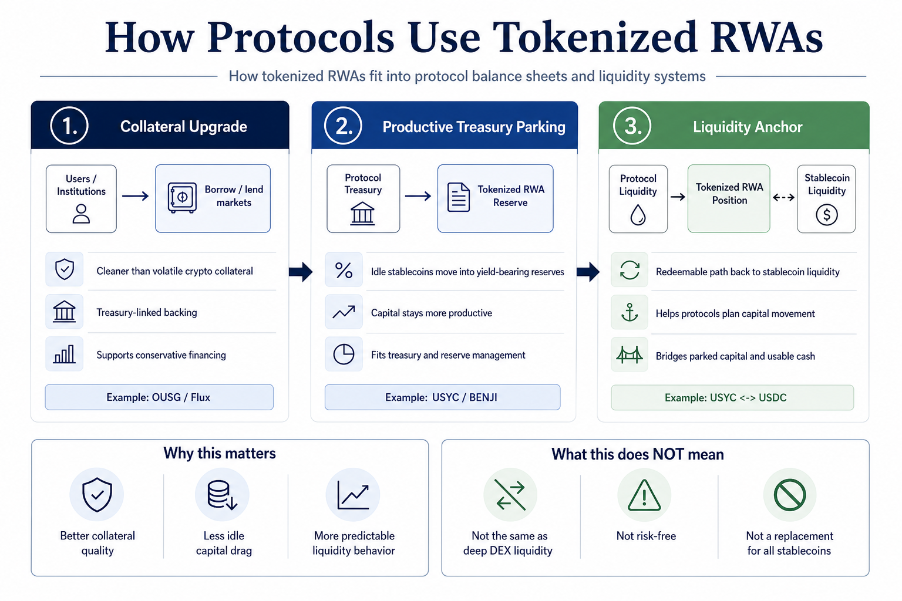

# How Protocols Use Tokenized Real-World Assets as Collateral and Liquidity Anchors

Protocols are using tokenized real-world assets as collateral and liquidity anchors because they solve a balance-sheet problem that crypto-native collateral does not solve cleanly on its own.

They let protocols hold or accept assets that are:

1. more conservative than volatile crypto collateral
2. often yield-bearing instead of idle
3. increasingly connected to stablecoin redemption and settlement rails

That is the core shift.

As of **June 2026**, tokenized Treasuries and tokenized money market products are not just RWA wrappers sitting off to the side. They are increasingly being used to anchor how protocols think about collateral quality, treasury parking, and liquidity management.

> **Summary callout:** The most important thing tokenized RWAs add is not headline yield. It is balance-sheet quality. They give protocols a way to park capital, post collateral, or structure liquidity around assets that are more legible, more conservative, and often more redeemable than pure crypto collateral.

*Editorial explainer: tokenized RWAs matter to protocols because they can improve collateral quality, reduce idle stablecoin drag, and create more predictable liquidity behavior.*

## Quick Answer

If you only need the short version, this is it:

Protocols use tokenized RWAs in three main ways:

1. as **higher-quality collateral** for borrowing, lending, and margin systems
2. as **productive treasury parking** for capital that would otherwise sit idle in stablecoins
3. as **liquidity anchors** that connect onchain capital to more predictable redemption and settlement pathways

This matters because many protocols do not only want more collateral.

They want collateral that is:

1. easier to understand
2. less correlated with crypto drawdowns
3. capable of earning while posted or parked
4. integrated with real redemption rails rather than depending only on secondary-market depth

One distinction should come early: **a liquidity anchor is not the same as a DEX liquidity pool**.

In this article, a liquidity anchor means an asset that helps stabilize how capital is parked, moved, financed, or redeemed inside a protocol stack. It is more about capital behavior and balance-sheet confidence than about being the deepest token pair on an AMM.

## Best Fit / Not Ideal For

**Best fit for:**

1. readers trying to understand why RWA products matter to DeFi market structure
2. treasury managers evaluating productive dollar-like collateral
3. analysts comparing tokenized Treasury assets with crypto-native collateral
4. builders thinking about collateral design, reserve assets, or treasury policy

**Not ideal for:**

1. readers looking for a generic list of top RWA tokens
2. users assuming tokenized RWAs automatically create deep DEX liquidity
3. anyone wanting a purely legal or accounting treatment memo

## Tokenized RWA Use at a Glance

| Protocol need | How RWAs help | Why protocols care | Real examples |
| --- | --- | --- | --- |
| Cleaner collateral | provide Treasury- or money-market-linked backing instead of pure crypto beta | reduces correlation to crypto risk and can improve balance-sheet quality | Flux Finance uses OUSG-linked collateral logic; USYC is positioned as yield-bearing margin or cross-margin collateral |
| Productive parked capital | let capital earn while waiting to be deployed | reduces idle stablecoin balances inside treasury and collateral systems | USYC connects yield-bearing capital with USDC workflows; BENJI distributes daily onchain dividends |
| Redemption-linked liquidity | give protocols access to assets with clearer subscription and redemption paths | helps anchor capital planning around more legible exit routes | OUSG offers 24/7 tokenized subscriptions and redemptions for qualified users; USYC supports near-instant USDC redemptions below capacity thresholds |
| Institutional collateral acceptance | make tokenized funds usable in trading and settlement stacks | expands the role of RWAs from passive holdings to active market plumbing | BUIDL accepted as collateral on Binance, Crypto.com, and Deribit |

## Key Takeaways

1. Protocols use tokenized RWAs to upgrade collateral quality, not just to chase yield.
2. The strongest RWA use cases sit where collateral management, treasury parking, and stablecoin settlement overlap.
3. A tokenized Treasury product can matter even without huge DEX volume if it creates a more predictable capital-management layer.
4. RWA collateral is strongest when redemption, custody, and legal structure are legible enough to support serious treasury use.
5. The strategic question is shifting from "can RWAs come onchain?" to "which RWAs become default balance-sheet assets for protocols?"

## Why Protocols Want More Than Just More Collateral

Protocols already have collateral.

The real problem is that much of crypto-native collateral comes with tradeoffs:

1. it is volatile
2. it is often correlated with broader crypto stress
3. it may not earn while sitting idle
4. its liquidity can deteriorate at exactly the wrong time

That creates a constant balance-sheet tension.

Protocols want capital that can do more than sit there.

They want assets that can:

1. preserve a more stable dollar-linked posture
2. remain productive
3. support borrowing or margin use
4. provide a cleaner treasury reserve layer

That is why tokenized RWAs increasingly matter beyond simple "real assets onchain" branding.

## What "Collateral Anchor" and "Liquidity Anchor" Actually Mean

### Collateral anchor

A collateral anchor is an asset that improves the quality of a protocol's collateral base.

That usually means:

1. lower volatility than crypto collateral
2. a clearer source of value
3. better fit for conservative borrowing or reserve design

### Liquidity anchor

A liquidity anchor is an asset that helps protocols organize capital behavior around a more predictable redemption and settlement logic.

That can mean:

1. a treasury reserve that can be redeemed into stablecoin liquidity
2. a yield-bearing asset that reduces idle stablecoin balances
3. a collateral asset that can support financing while keeping capital productive

This is why the category matters.

RWAs do not need to replace stablecoins to become important.

They become important by sitting **next to** stablecoins and changing how protocols allocate capital around them.

## 1. Borrow-Lend Protocols Use RWAs to Improve Collateral Quality

One of the clearest use cases is in lending and repo-style systems.

Ondo's documentation for Flux Finance describes it as an **onchain Treasury repo marketplace** that allows users to borrow and lend stablecoins backed by high-quality collateral such as **OUSG**.

That sentence matters because it captures the use case precisely.

The protocol is not just using an RWA token as a novelty listing.

It is using a Treasury-linked asset to support a stablecoin financing market.

### Why that matters operationally

For a borrow-lend market, the quality of collateral determines:

1. how defensible the risk framework is
2. how much stress can be tolerated
3. what kind of users the market can attract
4. whether the protocol is effectively financing volatile beta or financing conservative dollar-linked assets

OUSG is not permissionless retail cash.

But that is not the point.

The point is that a protocol can use a product with:

1. underlying Treasury-heavy exposure
2. tokenized subscription and redemption workflows
3. a more legible institutional design than pure crypto collateral

to create a cleaner financing base.

### Concrete operating example

Ondo's OUSG docs say:

1. instant investments and redemptions can happen **24/7**
2. the instant transaction minimum is **$5,000**
3. non-instant investment minimum is **$100,000**
4. non-instant redemption minimum is **$50,000**

Those specifics matter because they show the collateral is not just "safe" in theory.

It sits inside a defined operating model that a protocol or treasury team can actually plan around.

## 2. Trading and Margin Systems Use RWAs to Keep Collateral Productive

The second major use case is in trading infrastructure.

This is where tokenized RWAs stop looking like passive yield assets and start looking like capital-efficiency tools.

Circle's USYC page says the product can be used as **yield-bearing margin or cross-margin collateral** on supported exchanges and lending desks, keeping capital productive while securing positions.

That is one of the clearest summaries of the category's value.

Protocols and venues do not only want collateral that protects them.

They also want collateral that does not sit dead on the balance sheet.

### Why yield-bearing margin matters

If a protocol, venue, or treasury stack can hold a conservative asset that:

1. remains dollar-linked
2. earns short-term government-related yield
3. can move back toward liquid stablecoin form quickly

that changes capital behavior.

Instead of forcing users to choose between:

1. idle stablecoins
2. risky yield products
3. nonproductive posted collateral

the protocol can offer a more efficient middle ground.

### Concrete operating example

Circle says:

1. USYC is a tokenized money market fund
2. subscriptions and redemptions are conducted in **USDC**
3. redemptions below instant-redemption capacity settle in **one block time**
4. redemptions above that capacity settle **T+0** or **T+1**
5. a single API connects **USYC** and **USDC**

This is not just a product feature list.

It is a capital-routing design.

It allows protocols and institutional users to shift between productive collateral and liquid cash rails with less friction than traditional offchain money fund workflows.

### Dated context marker

Circle said on **July 24, 2025** that USYC was supported as yield-bearing off-exchange collateral for Binance's institutional clients, describing the setup as collateral backed by tokenized interests in U.S. Treasuries with near-instant USDC fungibility.

That matters because it shows the collateral use case moved beyond theory into live market infrastructure before the current 2026 growth phase.

## 3. RWA Products Are Becoming Accepted as Venue-Level Collateral

The third use case is even more strategically important.

It is not only that a protocol lists a tokenized RWA.

It is that major venues increasingly accept tokenized fund exposure as collateral.

Securitize has published that BlackRock's **BUIDL**, tokenized by Securitize, is accepted as collateral on:

1. **Binance**
2. **Crypto.com**
3. **Deribit**

That is a meaningful shift in market structure.

It means tokenized Treasury and money-market exposure is increasingly treated not as a side wallet position, but as usable balance-sheet material.

### Why that changes protocol design

Once an RWA asset is accepted as collateral on major venues, protocols and desks can start designing around it as:

1. reserve collateral
2. margin inventory
3. treasury parking
4. settlement-adjacent capital

At that point, the asset stops being just an investment wrapper.

It starts acting like market plumbing.

### Important nuance

This does **not** mean all protocols should rush to use the same RWA assets.

It means the acceptance pattern itself is important.

Collateral eligibility is one of the strongest signals that the market sees the asset as operationally useful, not merely yield-bearing.

## 4. Protocol Treasuries Use RWAs to Reduce Idle Stablecoin Drag

Another major use case is internal treasury management.

Many protocols hold large stablecoin balances for:

1. runway
2. incentives
3. liquidity support
4. reserve management

The problem is that idle stablecoins do not always earn, while more aggressive yield alternatives may introduce additional smart-contract or market risk.

Tokenized Treasury and money-market products give protocols a more conservative option.

### BENJI is a useful example of treasury-adjacent infrastructure

Franklin Templeton said on **April 30, 2026** that the broader BENJI suite represented **$1.98 billion** in AUM as of **April 29, 2026**, with cumulative peer-to-peer transfer volume above **$211 million** as of **March 31, 2026**.

Franklin also highlighted:

1. peer-to-peer transferability
2. daily onchain dividend distribution running **365 days a year**
3. intraday yield accrued by the second when tokens are transferred
4. near-instant settlement

For protocols, those features matter because they make a yield-bearing reserve asset more compatible with onchain treasury operations.

This is what a liquidity anchor looks like in practice:

1. the asset does not need to be the center of retail payments
2. it does need to fit treasury timing, transfer, and reserve behavior

## 5. RWAs Anchor Liquidity by Making Capital Behavior More Predictable

The phrase "liquidity anchor" can sound vague, so it is worth making concrete.

RWAs help anchor liquidity because they create a more predictable map between:

1. parked capital
2. collateralized capital
3. redeemable capital
4. stablecoin-linked capital

That predictability changes behavior.

A protocol treasury that holds only idle stablecoins behaves differently from one that can:

1. park some capital in a yield-bearing RWA product
2. post some as conservative collateral
3. redeem back into stablecoin liquidity when needed

This is why the category increasingly matters to protocol design.

Not because every RWA token is deeply liquid on a DEX.

But because the presence of these assets changes how protocols structure capital around liquidity needs.

## What RWAs Do Not Solve for Protocols

This part matters because the category is easy to overstate.

### 1. They do not automatically create open retail liquidity

Many products still have onboarding, eligibility, or jurisdictional restrictions.

### 2. They do not remove custody and issuer dependence

Protocols still rely on fund issuers, transfer agents, custodians, and redemption mechanics.

### 3. They do not eliminate capacity limits or timing constraints

Near-instant redemption often depends on thresholds, venue design, or fund-operating conditions.

### 4. They do not make collateral-risk management disappear

Risk teams still need to evaluate:

1. concentration
2. legal structure
3. oracle design
4. redemption friction
5. market acceptance

### 5. They do not replace stablecoins

Stablecoins remain stronger for open transferability and broad payment use. RWAs increasingly complement them by serving as the productive and conservative side of the onchain dollar stack.

## What Makes One RWA a Better Collateral or Liquidity Anchor Than Another

Protocols should not treat all RWA tokens as equivalent.

The stronger ones usually have five things:

### 1. Clear redemption pathways

If the asset can realistically move back into stablecoin or cash-like form under understandable rules, it is more usable as a treasury and collateral anchor.

### 2. Legible legal structure

Fund share, tokenized note, and money market token are not interchangeable from a risk perspective.

### 3. Real collateral acceptance

Use in borrow-lend markets, exchanges, or treasury systems matters more than a generic "RWA" label.

### 4. Productive but conservative yield

Protocols usually want credible, lower-risk yield, not another source of reflexive crypto exposure.

### 5. Operational compatibility

The asset needs to fit wallet, reporting, settlement, and treasury workflows.

## A Simple Decision Framework

If you want to judge whether a protocol should use a tokenized RWA as collateral or a liquidity anchor, ask these eight questions.

### 1. What exact job is the asset doing?

Collateral, treasury reserve, margin inventory, or liquidity bridge are different jobs.

### 2. How conservative is the underlying exposure?

Short-duration government-linked assets usually fit balance-sheet anchor roles better than more complex or opaque structures.

### 3. How redeemable is the product in practice?

Look at minimums, timing, stablecoin off-ramp paths, and capacity thresholds.

### 4. Is the asset already accepted in serious market infrastructure?

Collateral acceptance is a stronger signal than narrative interest.

### 5. Does the yield justify the operational complexity?

Some assets may be safe enough, but not worth the integration burden for smaller protocols.

### 6. How much issuer and custody dependence does the protocol accept?

Protocols need to be honest about how much offchain reliance they are taking on.

### 7. What happens in stress?

This includes redemption queues, transfer restrictions, venue treatment, and concentration risk.

### 8. Does this asset improve capital efficiency without weakening liquidity posture?

That is the real test.

### Practical rule of thumb

Tokenized RWAs are strongest as collateral and liquidity anchors when:

1. they improve collateral quality
2. they keep capital productive
3. they connect cleanly to stablecoin or redemption rails
4. their legal and operational structure is legible enough for serious treasury use

They are weaker when:

1. the protocol treats yield as the only decision variable
2. redemption paths are unclear
3. collateral acceptance is mostly aspirational
4. the asset is technically onchain but operationally hard to use

## Bottom Line

Protocols use tokenized RWAs as collateral and liquidity anchors because they help solve a balance-sheet problem that crypto has had for years: too much capital is either too volatile, too idle, or too operationally fragmented.

Tokenized Treasury and money-market products increasingly offer a middle layer.

They can be:

1. more conservative than crypto collateral
2. more productive than idle stablecoins
3. more operationally useful than legacy offchain fund exposure

That is why the category matters.

In **2025-2026**, the strategic win for RWAs is not only that they came onchain.

It is that protocols increasingly know what to do with them once they arrive.

## FAQ

### Are tokenized RWAs mainly about yield for protocols?

No. Yield helps, but the deeper value is improved collateral quality and better capital allocation.

### What does "liquidity anchor" mean here?

It means an asset that helps organize capital around more predictable parking, collateral, redemption, and settlement behavior.

### Do tokenized RWAs replace stablecoins inside protocols?

Not fully. They usually complement stablecoins by acting as the productive or conservative reserve layer.

### Why does collateral acceptance matter so much?

Because it shows the market is willing to treat the asset as usable financial infrastructure rather than just a passive wallet holding.

### What is the biggest mistake protocols make with this category?

Treating all RWA tokens as interchangeable without checking redemption design, custody stack, and legal structure.

## Source Notes

The analysis above is based primarily on official materials from:

1. [Ondo: Flux Finance](https://docs.ondo.finance/protocols/flux)
2. [Ondo: OUSG overview](https://docs.ondo.finance/qualified-access-products/ousg)
3. [Circle: USYC](https://www.circle.com/usyc)
4. [Circle press release: USYC as off-exchange collateral for Binance institutional clients, published July 24, 2025](https://www.circle.com/pressroom/circles-usyc-now-supported-as-yield-bearing-off-exchange-collateral-for-binances-institutional-clients)
5. [Securitize: BUIDL accepted as collateral on Binance and launched on BNB Chain](https://securitize.io/press/BlackRock-BUIDL-Tokenized-by-Securitize-Now-Accepted-on-Binance-and-Launches-on-BNB-Chain)
6. [Securitize: BUIDL accepted as collateral on Crypto.com and Deribit](https://securitize.io/learn/press/BlackRocks-BUIDL-Tokenized-by-Securitize-Accepted-as-Collateral-on-Cryptocom-and-Deribit)
7. [Franklin Templeton press release on BENJI, April 30, 2026](https://www.franklintempleton.com/press-releases/news-room/2026/franklin-templeton-stellar-development-foundation-mark-five-years-of-benji-the-first-u.s.-registered-tokenized-money-market-fund)
8. [RWA.xyz tokenized U.S. Treasuries dashboard](https://app.rwa.xyz/treasuries)

## Suggested Internal Links

1. Target: `Why Tokenized Treasuries Are Becoming a Default Yield Layer for On-Chain Capital`
Anchor: `tokenized treasuries` or `default yield layer`
Best placement: in sections explaining why conservative yield-bearing collateral is becoming infrastructure

2. Target: `What Redemption, Custody, and Issuer Risk Look Like in Tokenized RWA Products`
Anchor: `redemption, custody, and issuer risk` or `RWA risk framework`
Best placement: in sections warning that collateral quality still depends on legal structure and exit mechanics

3. Target: `What Reserve Transparency Really Tells Users About a Stablecoin Issuer`
Anchor: `backing and redemption risk` or `trust framework`
Best placement: in sections comparing tokenized RWA anchors with fiat-backed stablecoin reserve logic

4. Target: `How Users Are Actually Using USDC and USDT for Real Payment Workflows`
Anchor: `real payment workflows` or `stablecoin settlement use cases`
Best placement: in sections explaining why payment balances and treasury balances increasingly split into different product lanes
