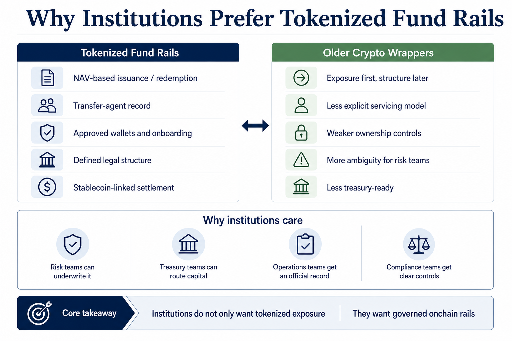

# Why Institutions Prefer Tokenized Fund Rails Over Older Crypto Wrappers

Institutions increasingly prefer tokenized fund rails over older crypto wrappers because the newer model gives them something much closer to operational finance infrastructure and something much less like improvised token exposure.

That is the real distinction.

Older wrappers helped bring traditional-looking exposure into crypto markets, but they often left institutions with too many unanswered questions around:

1. who keeps the official ownership record
2. how subscriptions and redemptions actually work
3. whether transfers happen inside a governed eligibility framework
4. how the asset moves back into stablecoin or cash-like liquidity

Tokenized fund rails are increasingly solving those questions directly.

As of **June 2026**, the strongest institutional RWA products are not just tokenized assets. They are tokenized assets sitting inside a documented fund, transfer-agent, custody, and redemption framework.

> **Summary callout:** The reason institutions prefer tokenized fund rails is not that they love blockchain branding. It is that fund rails translate onchain ownership into a structure that risk teams, treasury teams, and operations teams can actually underwrite.

*Editorial explainer: institutions increasingly prefer fund rails because they turn tokenized exposure into a governed operating system rather than a loose wrapper.*

## Quick Answer

If you only need the short version, this is it:

Institutions prefer tokenized fund rails over older crypto wrappers because fund rails usually provide five things that older wrappers often handled less cleanly:

1. **NAV-based issuance and redemption**
2. **official recordkeeping through a transfer-agent or fund-servicing stack**
3. **documented eligibility and wallet controls**
4. **clearer legal structure**
5. **more direct links to stablecoin and settlement workflows**

That makes tokenized fund rails easier to fit into institutional requirements for:

1. treasury management
2. collateral policy
3. operational oversight
4. compliance and onboarding
5. redemption planning

This article uses the phrase **older crypto wrappers** broadly to mean earlier models where tokenized exposure often felt more like a custodial or market-facing wrapper around an asset than a fully legible fund rail with documented servicing, transfer, and redemption logic.

One important nuance: this is partly an **inference from product design and documentation**, not a claim that every institution has publicly stated the same preference in the same words. The inference is strong because the products gaining traction are the ones that make institutional controls most explicit.

## Best Fit / Not Ideal For

**Best fit for:**

1. readers trying to understand the infrastructure difference between RWA fund rails and older wrapper models
2. treasury and operations teams mapping what makes an onchain product institution-ready
3. analysts studying why tokenized funds are gaining traction faster than some earlier wrapper structures
4. builders designing products for institutional RWA access

**Not ideal for:**

1. readers looking for a simple token ranking
2. users who want a legal memo on one specific jurisdiction
3. anyone assuming this article is about retail wallet UX rather than institutional infrastructure

## Tokenized Fund Rails vs Older Crypto Wrappers at a Glance

| Dimension | Tokenized fund rails | Older crypto wrappers |
| --- | --- | --- |
| Core model | tokenized representation of a fund or fund-like vehicle with documented servicing | tokenized exposure that may feel more like a market wrapper than a fully governed fund rail |
| Issuance and redemption | typically tied to NAV, fund processes, and documented subscription or redemption rules | may be less explicit, more venue-driven, or more dependent on wrapper-specific mechanics |
| Ownership record | often maintained through transfer agents or formal servicing systems | may rely more heavily on custodial or platform-level arrangements |
| Eligibility and transfer control | explicit onboarding, approved wallets, or investor qualification rules | often less clearly framed as a governed institutional record system |
| Treasury and risk-team fit | stronger because workflows and controls are legible | weaker when the structure looks operationally improvised or opaque |
| Stablecoin and settlement integration | increasingly connected to USDC or similar rails for movement between yield-bearing and liquid cash | often less purpose-built for institutional treasury routing |

## Key Takeaways

1. Institutions do not only want tokenized exposure. They want tokenized exposure that fits existing control frameworks.
2. Tokenized fund rails are winning because they make issuance, redemption, recordkeeping, and eligibility more operationally explicit.
3. The strongest products are increasingly fund-first and blockchain-enabled, not blockchain-first and structure-later.
4. Stablecoin-linked settlement matters because it turns tokenized fund exposure into a usable treasury tool rather than a passive holding.
5. The market is maturing from "can we wrap this asset?" to "can this asset sit inside institutional operating rails?"

## Why Older Crypto Wrappers Hit Institutional Limits

Crypto wrappers were useful for early market development.

They proved that tokenized exposure could circulate onchain or inside digital-asset markets.

But institutions usually need more than exposure.

They need answers to operational questions such as:

1. where is the authoritative record of ownership?
2. what document governs transfer and redemption?
3. who can hold the asset?
4. how does the product move between fund exposure and usable liquidity?
5. what happens if a transfer, wallet, or servicing issue occurs?

When these answers are weak, a product may still work for trading.

It is harder to use it for:

1. treasury reserves
2. conservative collateral
3. off-exchange margin
4. larger institutional balance-sheet workflows

That is where tokenized fund rails have an advantage.

## What Tokenized Fund Rails Actually Add

### 1. NAV-based issuance and redemption

One of the biggest differences is that tokenized fund rails tend to make the relationship between token and underlying exposure much more formal.

Ondo's OUSG documentation explains that the token amount a user receives is determined by converting deposited stablecoins into USD value and dividing by the current **NAV** of the OUSG token. On redemption, the process works in reverse, with returned USDC determined by the redeemed token amount multiplied by NAV.

That matters because it gives institutions a familiar operating logic:

1. subscriptions happen against a defined asset value
2. redemptions happen against a defined asset value
3. the token is not just "floating around" as a loose claim

Franklin Templeton's prospectus follows the same broader logic. It says fund shares are processed at the next calculated NAV and may be purchased or redeemed through the app or institutional web portal on business days.

That is much closer to institutional fund plumbing than to a generic crypto wrapper model.

### 2. Official recordkeeping and transfer-agent infrastructure

This is one of the strongest reasons institutions are more comfortable with tokenized fund rails.

Franklin Templeton's prospectus says the fund's **transfer agent maintains the official record of share ownership** through a proprietary blockchain-integrated system.

That single point is extremely important.

It tells institutions:

1. there is a recognized authoritative ownership system
2. blockchain activity sits inside a formal servicing framework
3. recordkeeping is not left entirely to informal token movement assumptions

The same prospectus also says that only wallets created by or approved by the transfer agent are authorized to purchase, redeem, receive, hold, or transfer shares of the fund.

This can sound restrictive from a crypto-native perspective.

From an institutional perspective, it is often the point.

It makes the control model legible.

### 3. Explicit eligibility and onboarding rails

Institutions do not usually see eligibility controls as friction alone.

They often see them as part of product quality.

Ondo's OUSG documentation says any investor eligible for its Qualified Access Funds and who has completed onboarding may invest, and that OUSG tokens may be freely transferred between investors already onboarded to those funds.

Circle's USYC page says:

1. the minimum investment is **$100,000**
2. USYC is available only to **eligible non-U.S. persons**
3. additional eligibility restrictions may apply

Again, these are not merely legal disclaimers.

They are part of why the rails are institution-ready.

The product is designed around a known participant set rather than around generalized wallet openness.

### 4. Stablecoin-linked treasury routing

Another reason institutions prefer fund rails is that the best current examples connect fund exposure directly to stablecoin workflows.

Circle says all USYC subscriptions and redemptions are conducted in **USDC**. It also says a single API connects **USYC** and **USDC**, enabling movement between yield-bearing capital and liquid cash across onchain workflows.

That is a major infrastructure improvement.

It means the product is not only a tokenized fund share.

It becomes a treasury routing component.

Ondo shows a similar logic in a different form. Its OUSG docs explain that deposited USDC is routed to the fund's Coinbase account and used to purchase the underlying holdings, while OUSG supports instant redemptions back into USDC for qualified flows.

This is one of the clearest reasons institutions prefer fund rails over older wrappers.

The fund rail is connected to a usable liquidity path.

### 5. A more institution-readable legal and servicing stack

Fund rails are also easier to underwrite because the structure usually comes with:

1. fund documents
2. transfer-agent logic
3. custody arrangements
4. defined subscription and redemption mechanics
5. clearer service-provider responsibilities

That does not make them risk-free.

It makes them more institution-readable.

That distinction matters.

## What This Looks Like in Real Products

### Example 1: USYC is built as a treasury and collateral rail, not just a token

Circle's USYC materials make the design intent unusually explicit.

Circle describes USYC as:

1. a **tokenized money market fund**
2. institutional-grade, yield-bearing collateral
3. a product with **24/7 access**
4. a product with near-instant redemptions into **USDC**

Circle also says:

1. redemptions below instant capacity settle in **one block time**
2. redemptions above instant capacity settle **T+0** or **T+1**
3. the product supports automated interactions through smart contracts

That is not the language of a loose wrapper.

It is the language of an operating rail.

### Example 2: OUSG looks like a governed fund access layer

OUSG also illustrates the preference clearly.

Its docs emphasize:

1. **24/7/365** minting and redemption for supported flows
2. defined minimum sizes: **$5,000** instant, **$100,000** non-instant investment, **$50,000** non-instant redemption
3. investor eligibility and onboarding
4. formal fund documentation

Those are the ingredients institutions expect in a serious product.

They may narrow access, but they also reduce ambiguity.

### Example 3: Franklin shows how a traditional fund manager can put rails onchain without abandoning controls

Franklin Templeton's prospectus is valuable because it makes the architecture visible.

It shows:

1. official ownership record maintained by a transfer agent
2. approved-wallet logic
3. app and portal-based purchase and redemption workflows
4. NAV-based processing on business days

That is exactly the kind of design that helps institutions say:

1. we understand the operating model
2. we know where records live
3. we know how transfers and redemptions are governed

That is much closer to institutional comfort than an earlier model where token exposure might exist without this level of servicing clarity.

## Dated Context Markers

Two concrete dates help show where the market moved from concept to infrastructure:

1. Circle said on **July 24, 2025** that USYC was supported as yield-bearing off-exchange collateral for Binance's institutional clients.
2. Ondo's OUSG docs say the **0.15%** management fee waiver remained in place until **July 1, 2026**, showing that product design and pricing were still being used aggressively to accelerate qualified-access adoption in the current cycle.

## Why This Preference Shows Up in Institutional Behavior

An inference from these product designs is that institutions increasingly prefer rails that reduce ambiguity across four teams at once:

### 1. Risk teams

They want defined assets, documents, eligibility, and servicing logic.

### 2. Treasury teams

They want products that can move between yield-bearing exposure and liquid stablecoin balances with predictable rules.

### 3. Operations teams

They want authoritative records, approved wallet frameworks, and service-provider clarity.

### 4. Compliance teams

They want onboarding, investor qualification, and transfer controls that are not bolted on after the fact.

Older wrappers could sometimes satisfy part of that stack.

Tokenized fund rails satisfy more of it directly.

## What Tokenized Fund Rails Do Not Solve

This category is strong, but it is not magic.

### 1. They do not remove custody or issuer risk

Institutions still rely on issuers, fund administrators, transfer agents, custodians, and banking or exchange partners.

### 2. They do not become fully open retail assets by default

Many of the strongest products remain gated by jurisdiction, onboarding, or qualification rules.

### 3. They do not make settlement infinite or frictionless

Redemption capacity, business-day processing, and minimum thresholds still matter.

### 4. They do not replace every stablecoin function

Stablecoins remain stronger for generalized payment and broad open transfer use.

### 5. They do not make structure unimportant

A poor fund rail can still be weak if the legal and operational layers are unclear.

## A Simple Decision Framework

If you want to judge whether a tokenized product is really a fund rail that institutions can use, ask these eight questions.

### 1. Is issuance tied to NAV or a similarly formal value process?

If not, the institutional fit is weaker.

### 2. Who maintains the official ownership record?

This is one of the strongest signals that separates governed rails from looser wrapper models.

### 3. Are eligibility and transfer controls explicit?

Documented onboarding and approved-wallet logic matter more than many crypto-native users expect.

### 4. Is there a usable redemption path into stablecoin or cash-like liquidity?

A fund rail without a practical exit path is much less useful for treasury purposes.

### 5. Are the servicing roles clear?

Issuer, transfer agent, custodian, and settlement partner roles should be understandable.

### 6. Does the product fit treasury and collateral workflows?

Products that can route between yield-bearing exposure and liquid balances are stronger.

### 7. Is the legal structure legible enough for risk approval?

Fund shares, notes, and wrappers should not be blended together.

### 8. Does the product reduce operational ambiguity more than it adds complexity?

That is the real test for institutional adoption.

### Practical rule of thumb

Institutions prefer tokenized fund rails when:

1. the structure is documented
2. the ownership record is governed
3. the redemption path is clear
4. the stablecoin or cash-routing logic is usable
5. the product fits real treasury and collateral workflows

They hesitate when:

1. the token claim is unclear
2. the servicing stack is opaque
3. redemption depends too much on ad hoc market behavior
4. the wrapper looks easier to trade than to underwrite

## Bottom Line

Institutions prefer tokenized fund rails over older crypto wrappers because fund rails translate tokenization into a form that institutional systems can actually use.

They give institutions more than exposure.

They give them:

1. documented issuance and redemption
2. official recordkeeping
3. eligibility control
4. clearer legal structure
5. better treasury routing into stablecoin liquidity

That is why the category is maturing.

The winning products are not the ones that merely put assets onchain.

They are the ones that make onchain ownership behave like serious financial infrastructure.

## FAQ

### What is the core difference between a tokenized fund rail and an older wrapper?

A tokenized fund rail usually has clearer fund documentation, official recordkeeping, eligibility controls, and defined redemption mechanics.

### Why do approved wallets matter?

Because institutions often prefer controlled transfer environments they can underwrite rather than open systems with ambiguous participant rules.

### Does this mean open crypto-native assets are obsolete?

No. They serve different purposes. The point is that institutional treasury and collateral workflows often want more structure than open retail markets do.

### Are tokenized fund rails basically the same as stablecoins?

No. Many are fund shares or related exposures with different rights, access rules, and redemption logic.

### What is the biggest mistake in this topic?

Treating "tokenized" as the whole answer when the real institutional decision is about servicing, records, and redemption design.

## Source Notes

The analysis above is based primarily on official materials from:

1. [Ondo: OUSG overview](https://docs.ondo.finance/qualified-access-products/ousg)
2. [Ondo: OUSG eligibility](https://docs.ondo.finance/qualified-access-products/eligibility)
3. [Ondo: OUSG onboarding and KYC](https://docs.ondo.finance/qualified-access-products/onboarding-and-kyc)
4. [Circle: USYC](https://www.circle.com/usyc)
5. [Circle press release: USYC as off-exchange collateral for Binance institutional clients, published July 24, 2025](https://www.circle.com/pressroom/circles-usyc-now-supported-as-yield-bearing-off-exchange-collateral-for-binances-institutional-clients)
6. [Franklin OnChain U.S. Government Money Fund prospectus](https://www.franklintempleton.com/forms-literature/download-preview/9001-P)

## Suggested Internal Links

1. Target: `What Redemption, Custody, and Issuer Risk Look Like in Tokenized RWA Products`
Anchor: `redemption, custody, and issuer risk`
Best placement: in sections explaining why institutional preference depends on servicing and legal structure

2. Target: `How Protocols Use Tokenized Real-World Assets as Collateral and Liquidity Anchors`
Anchor: `collateral and liquidity anchors`
Best placement: in sections explaining why better rails matter once institutions actually use RWAs in market structure

3. Target: `Why Tokenized Treasuries Are Becoming a Default Yield Layer for On-Chain Capital`
Anchor: `default yield layer` or `tokenized treasuries`
Best placement: in sections showing how fund rails make conservative onchain yield usable at scale

4. Target: `What Reserve Transparency Really Tells Users About a Stablecoin Issuer`
Anchor: `trust framework` or `backing and redemption risk`
Best placement: in sections comparing institutional trust in fund rails with trust in private stablecoin issuers
